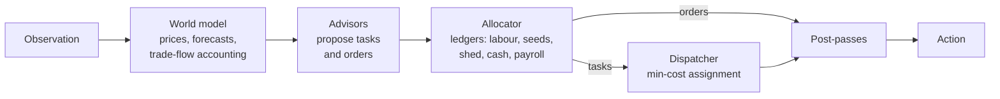

# Kaggriculture: a planning agent for a two-player farming simulation

My entry to Kaggle's [Kaggriculture](https://www.kaggle.com/competitions/kaggriculture) simulation competition (August–September 2026). Two agents each run a farm for a 720-turn season: they plant five crops, raise three animal species, hire up to a dozen workers a day, and sell into a market whose prices both players move. The richer farm at the end wins.

**Read the full write-up: [report/paper.md](report/paper.md)**. It covers the system design, a hierarchical-RL attempt and why it was retired, the evaluation methodology, every adopted and rejected change with effect sizes, and an honest gap analysis.

## Results in brief

- **Final standing.** 33 submissions over six weeks. The final pair rated 756.4, rank 5,169 of 10,246 (provisional, 3 October 2026; leaderboard median 767).
- **Execution beat learning.** A rule pipeline with a min-cost-matching dispatcher outperformed every PPO and behavioural-cloning variant I built on top of it. The tuned dispatcher alone was worth **+$9,968 per game** on held-out seeds (t = 15.1).
- **The interface set the ceiling.** A *perfect* clone of the strongest public bot, replaying that bot's own decisions through my strategy interface, scored only 52% of the bot's money, below my plain rule agent.
- **Measurement was most of the work.** The engine's end-of-day random draws couple each player's shop sequence to the *other* player's land use. That makes paired variance 13× larger for any early-game change. The paper documents nine such traps, each quantified, and the instruments built around them.
- **Real effects, little rating movement.** Eleven later changes each improved paired margin by $0.8k–7.2k with confidence intervals above zero, yet the rating barely moved: the median online loss was −$17.6k.

## How the agent works



- **Advisors propose, the allocator decides, the dispatcher moves.** Each silent-failure rule of the engine (the 10-order cap, the 100-item shed, all-or-nothing planting) is enforced in exactly one place.
- **The dispatcher solves an assignment problem every turn.** It matches free units to tasks with cost `16 × distance − priority`, using a dependency-free Jonker–Volgenant solver. The weight of 16 was tuned on one seed set and confirmed on another.
- **Valuations are dated and margin-aware.** Crops and animals are valued by laying their output on the calendar and pricing each lot on its sale day. Animal valuation also counts the price drop it causes the *opponent*, because the game is decided by the margin, not by own cash.

## Quick start

```bash
cd kaggriculture
python -m venv .venv && source .venv/bin/activate
pip install -r requirements.txt

python scripts/play.py                                  # one game vs the built-in starter bot
python scripts/play.py --opponent self --html game.html # self-play, with a replay viewer
python -m pytest -q                                     # 21 tests, ~15 s

# Paired evaluation of a modified copy against the original (both seats, seed-clustered CI)
mkdir /tmp/variant && cp -r main.py farm_agent /tmp/variant/   # ...edit /tmp/variant/farm_agent/config.py...
python scripts/paired_eval.py --candidate /tmp/variant --control . --opponents starter pass --seeds 0:20

python scripts/build_submission.py                      # dist/submission.tar.gz, verified from a clean directory
```

## Layout

| Path | Contents |
|---|---|
| `main.py` | Kaggle entry point: one `FarmAgent` per player |
| `farm_agent/world/` | Observation parsing, the engine's price curves, dated forecasts, trade-flow accounting (`market_belief.py`), livestock valuation |
| `farm_agent/advisors/` | Survival, maintenance, crop, animal, expansion, market, wheat, endgame |
| `farm_agent/allocator.py` | Arbitration and the labour, seed, shed, cash and payroll ledgers |
| `farm_agent/dispatcher/` | Four-phase dispatcher and the assignment solver |
| `farm_agent/planners/` | Early cash, late-season wheat, shed-overflow fixes, sell ordering |
| `farm_agent/config.py` | Every constant and priority, with the reasoning behind it |
| `scripts/` | `play.py`, `paired_eval.py`, `build_submission.py` |
| `tests/` | Solver optimality, agreement with the engine's rules and prices, end-to-end games |
| `report/` | The paper, its figures, the data behind them, and `make_figures.py` |
| `kaggle_notebook/` | The Kaggle notebook (generated from the source), its metadata, and the Discussion post |

The code here is a cleanup of the final submission. It drops flags that were switched off, the experiment scaffolding behind them and harness-only logging, and moves per-game state onto a per-player object. It plays **action-for-action identically** to the submitted agent across 80 seeded games against eight opponents. Tested with Python 3.13; standard library only at run time, `kaggle-environments==1.32.7` to play locally.
