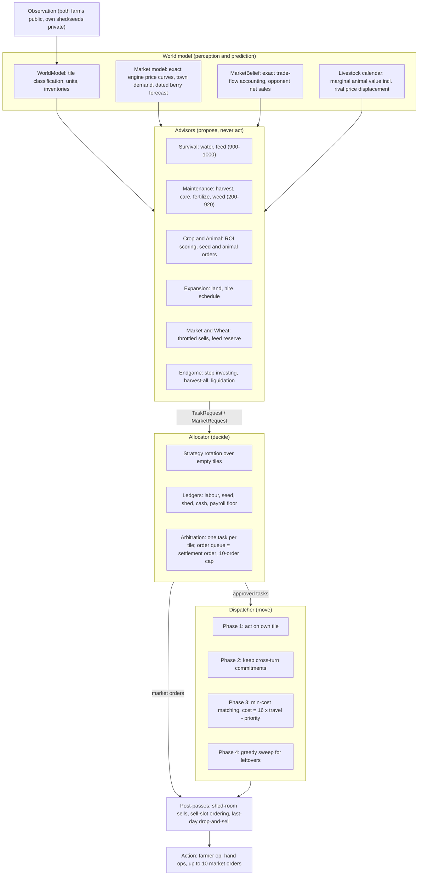
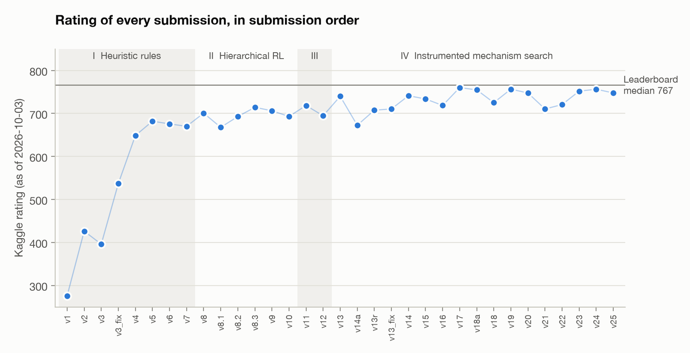
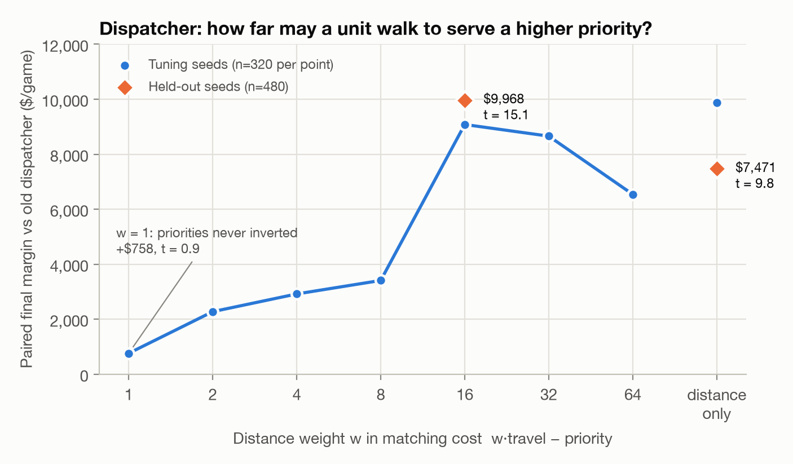
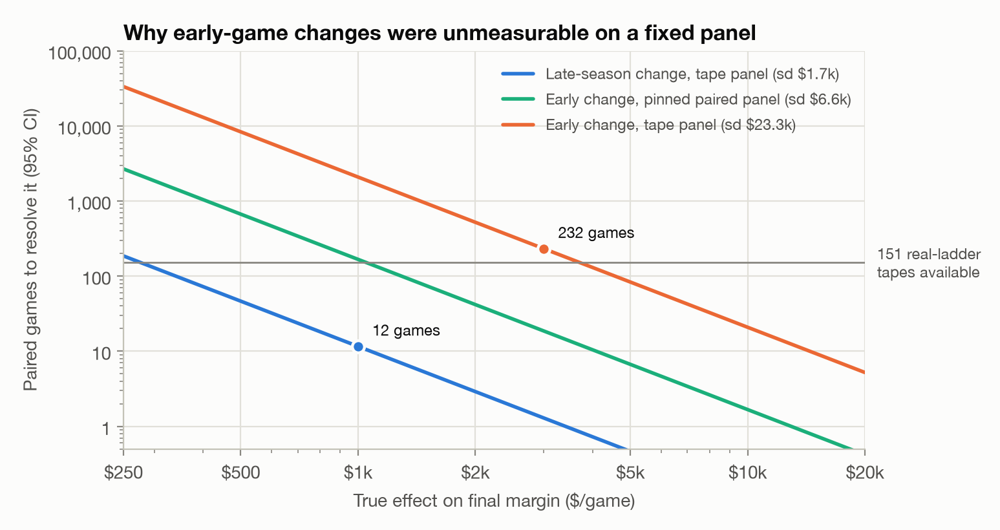
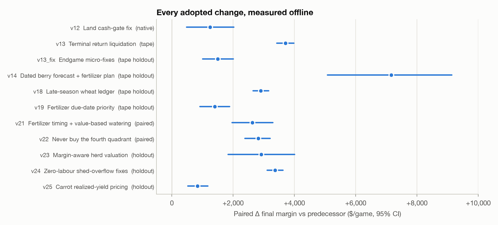
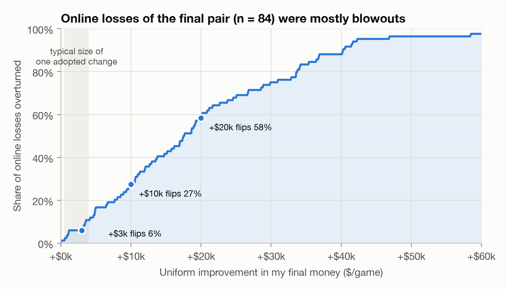

# Measure Before You Optimize: Building and Evaluating a Planning Agent for a Two-Player Farming Simulation

**Wangshu Pang** · October 2026

*A case study from six weeks and 33 submissions to the Kaggle "Kaggriculture" simulation competition*

---

## Abstract

Kaggriculture is a two-player, 720-turn farming simulation in which each agent controls a farmer and up to a dozen hired hands, plants five crops, raises three animal species, and sells into a market that both players share and whose prices respond to supply. Agents are scored by final bank balance and ranked on a live skill-rating ladder. I built a rule-based agent organised as a four-stage decision pipeline: a world model, a set of "advisor" modules that propose actions, a central allocator that enforces the engine's hard constraints through explicit ledgers, and a dispatcher that assigns tasks to units by min-cost bipartite matching. I also built a hierarchical reinforcement-learning variant on top of the same pipeline. Over six weeks I made 33 submissions and simulated several hundred thousand full seasons offline.

The work produced three groups of findings. **(1) Architecture.** A learned strategy layer (PPO over a compact directive interface) never beat the hand-designed pipeline. A diagnostic showed why: a *perfect* imitation of the strongest public bot, replaying that bot's own reconstructed directives through my interface, reached only 52% of the teacher's score, below my rule baseline. The interface could not express the teacher's strategy. In contrast, an execution-layer change, replacing greedy task assignment with a Hungarian matching whose distance-versus-priority exchange rate was tuned, was worth +$9,968 per game on held-out seeds (t = 15.1). **(2) Measurement.** Offline evaluation in this environment is unusually treacherous. A shared end-of-day random-number stream couples the opponent's shop draws to my own land use, inflating paired variance 13× for any early-game change. Replaying recorded opponents favours whichever variant deviates most. Pure tie-break perturbations behave like fixed strategy changes worth about ±$2,000. I built a measurement stack to deal with this: exact seed replay of ladder games, opponent identification from public code, pinned-randomness paired panels, placebo arms, multi-salt pairing, and preregistered decision rules. I used it to accept or reject 40+ candidate changes. **(3) The limits of incremental improvement.** Eleven changes adopted after that overhaul each improved paired final margin by $0.8k to $7.2k with 95% confidence intervals excluding zero, and where checked online their mechanisms behaved as predicted. The ladder rating barely moved, because the median online loss was −$17.6k and a $3k improvement overturns only 6% of losses. My final pair of submissions rated 756.4 (rank 5,169 of 10,246, provisional; leaderboard median 767). The top of the ladder was held by agents replaying whole-season plans mined from expert games, a strategy class my reactive architecture could not represent. I report the system, the methodology, the negative results, and an honest gap analysis.

---

## 1. Introduction

Simulation competitions are an attractive test-bed for decision-making systems. The environment is fully specified, the objective is unambiguous, and the agent is evaluated against other people's agents rather than against a fixed dataset. They are also unforgiving in two ways that matter for engineering practice. First, the score that counts, a ladder rating, is noisy, lagging, and computed against a population of opponents that keeps changing. Second, every offline proxy for that score is a model of the opponent population, and models can be wrong in ways that look like real results.

This report describes my entry to the Kaggriculture competition [1]. I treat it less as a leaderboard story and more as a case study in two questions that recur in applied ML and decision systems:

1. **How should a decision system be decomposed** when the action space is large (a farmer and a dozen or so hired hands acting every turn, plus up to 10 market orders), the engine has hard silent-failure constraints, and the horizon is long (720 turns, with crops that take 10+ days to pay off)?
2. **How do you know whether a change helped** when the online signal is too noisy to resolve the effects you can build, and every offline instrument has its own biases?

**Contributions.**

- A layered agent architecture (§3) in which every engine constraint is enforced in exactly one place, every candidate change ships behind a flag that reproduces the previous agent byte-for-byte when off, and the execution layer is fully decoupled from economic logic.
- An execution-layer result (§6): global min-cost assignment of units to tasks with a tuned distance/priority exchange rate (+$9,968/game held-out), and a hire schedule that fixed a bootstrapping failure. Together they were worth +$19,926/game (t = 27.4), the largest single improvement of the project.
- A negative result on hierarchical RL and behavioural cloning (§5), with a diagnostic, the "perfect-clone ceiling", that localises the failure to the strategy interface rather than to training.
- A measurement methodology for paired evaluation in a two-player environment with shared randomness (§7), together with a catalogue of nine measurement pitfalls, each quantified on this project (Table 4).
- A results section (§8) that reports adopted and rejected changes alongside an analysis of why offline gains did not show up in the online rating, and what the strongest agents were doing differently.

---

## 2. The environment

### 2.1 Game summary

Each player owns a 10×10 farm split into four 5×5 quadrants. Only the north-west quadrant is unlocked at the start; the other three cost $1,000, $2,000 and $4,000. Each player starts with $3,000, a single farmer, and the option to hire hands every day at Fibonacci-increasing cost (1, 1, 2, 3, 5, 8, …, reset daily). Each unit takes one action per turn: move, plant, water, harvest, fertilize, feed, care for an animal, collect fertilizer, pick up from or drop to the central shed, build a coop or pasture, or dig. A season is 30 days of 24 turns.

- **Crops.** Wheat, carrot and melon are one-time harvests. Tomato and strawberry produce repeatedly. Watering inside a bonus window raises one-time yield (doubled when fertilized). Ongoing crops yield 2 instead of 1 on a production day only if the tile was both watered and fertilized that day. Two consecutive dry days kill a plant.
- **Animals.** Geese (eggs), cows (milk) and sheep (wool) must be fed wheat daily or they escape. Caring banks a bonus paid out at the next production; each animal also drops one unit of fertilizer per day.
- **Market.** Seeds, animals and two buy-back goods (wheat and fertilizer) have fixed prices. Every product's sale price depends on the shared market inventory through a per-product, piecewise shape function (linear, square, square-root, log, or hinge, with a different shape on each side of the reference inventory). Premium goods such as melon, wool, milk and strawberry crash steeply under a glut; staples absorb oversupply gently.
- **Town demand.** A town centre buys one of each product per day. Every three days an additional shop is drawn at random (with replacement, up to eight), and each shop consumes the products on its menu every four turns. Which shops appear largely determines which premium goods are worth producing.
- **Score.** Final bank balance. Unsold goods, standing crops and animals are worth nothing.

### 2.2 Engine facts that shaped the design

Much of the engineering effort went into facts that are not prominent in the rules but dominate outcomes. Table 1 lists the ones that most directly shaped the architecture or the measurements.

**Table 1.** Engine behaviours and their design consequences.

| Engine behaviour | Consequence |
|---|---|
| Each turn resolves **unit actions → market orders → town consumption → (last turn of day) end-of-day sweep**. | Goods bought this turn can be picked up only next turn. A sell order on the last turn of a day settles *before* the overnight pour. That ordering is the basis of the v24 fix (§8.2). |
| The shed holds 100 non-seed items. At the end-of-day pour, carried items beyond that are **destroyed**, and buys that would overflow fail silently. | A shed-capacity ledger in the allocator. Before v24, overflow destroyed about $5k of produce per game. |
| If a turn's `PLANT` actions for a crop exceed seed stock, **all** of them are voided. | Per-turn seed budget enforced in the dispatcher. |
| At most **10 market orders** per turn; extras are silently dropped. | Order position equals settlement order, so orders are sorted by priority. Seed purchases, the lowest priority, were the first casualty: 154 dropped orders per game, measured. |
| Only **wheat and fertilizer** can be bought; a buy-then-sell round trip nets zero. | Own wheat is worth only the bid–ask spread (about $5.5/unit) at the margin, so contested labour should never go to wheat (§8.3). |
| The episode ends at step 718; the final end-of-day sweep **never runs**. | Goods carried on the last day are worthless unless walked home and sold: +$3.7k/game once fixed. |
| The end-of-day RNG, seeded by `(seed · 1,000,003) XOR day`, draws a weed check **for every empty tile before** drawing the next shop. | My land use changes which shops *both* players get. This is the central measurement hazard (§7.1). |
| Replays store the episode seed and engine version. | Any ladder game can be re-simulated exactly offline (§7.2). |

### 2.3 Evaluation setting

Each submission receives its own rating, starting at 600 and converging over roughly 100 episodes (about 15–20 episodes per day after an initial burst). Only a team's latest two submissions remain active. After the 30 September deadline those two keep playing for about two weeks before final ranks are computed from a Bradley–Terry model of the results [8]. Three practical consequences follow. A new submission's rating is uninformative for days. Each submission displaces an older one from the final pair. And rating differences of 20–30 points between submissions are within noise: the same bundle submitted twice in different weeks (v13, byte-identical archives) settled at 739.9 and 707.6.

---

## 3. System design

### 3.1 Design goals

Four goals drove the architecture. Most of them were learned the hard way in the first week.

1. **One owner per constraint.** Each silent-failure rule in Table 1 is enforced in exactly one module. Early versions scattered these checks, and each scattered check eventually disagreed with another. Example: a stale cash pre-check in the land-purchase code vetoed purchases that the allocator's settlement-ordered cash ledger knew were affordable. Fixing that one line (v12) was worth +$1,251/game.
2. **Economic logic never steers units directly.** Advisors express intent as prioritised task and order requests. Only the dispatcher moves units. This separation is what made the dispatcher replaceable in one afternoon (§6).
3. **Every change is a flag, and "off" means identical.** Candidate behaviours ship as flags whose default reproduces the previous agent byte-for-byte. An arm builder produces an isolated, renamed copy of the package with chosen flags flipped. Equivalence is checked on complete games, comparing action hashes, rewards and shop sequences, before any comparison is trusted.
4. **Robust in the sandbox.** Standard library only, no files outside the bundle, no reliance on the working directory. The first PPO submission silently fell back to the rule agent because its checkpoint path was resolved against a working directory the Kaggle harness does not provide. That cost one full submission and motivated a NumPy-only inference path and loud fallback logging.

### 3.2 Architecture



**Figure 1.** The decision pipeline of the final agent (v25). Arrows carry data only; no stage calls back into an earlier one within a turn.

The released agent is about 3,200 lines of Python in 30 files, standard library only. A full 720-turn game, engine included, simulates in a few seconds on one core.

### 3.3 World model

`WorldModel` parses the observation and classifies every tile into task sets (needs water, needs harvest, needs feed, and so on). Classification is where several costly bugs lived, because a task that is never classified is never prioritised. For example, wheat at its optimal harvest age was classified as "harvest" and therefore never watered on harvest day. That cost about one unit of yield per one-time crop.

The market model is an exact port of the engine's price function, checked against the engine source. On top of it sit three forecasting components:

- **Dated berry forecast.** Projects both farms' remaining strawberry and melon production days and the town's per-day demand, including shops not yet revealed in expectation. It drives planting valuation and the fertilizer service plan.
- **MarketBelief.** Exact trade-flow accounting. Because I know my own orders and observe market inventory before and after each turn, the identity `Δinventory = Σ(sales above the $1 floor − buys) − town consumption` holds with zero error on 1.9 million product-turns. Opponent net sales can therefore be recovered exactly from public data.
- **Livestock calendar.** Prices a marginal animal on a calendar: its production days, care bonuses, feed cost, and the price displacement its output causes. In v23 that displacement was extended to the *rival's* sales (§8.2).

All forecasting modules are observation-only. They never read opponent private state, future shops or episode identifiers.

### 3.4 Advisors

Advisors are small, independent modules (50–130 lines each) that return `TaskRequest`s (tile, action, priority, items the unit must carry) and `MarketRequest`s (order, priority, cost). All priorities are defined in one configuration file, so the dispatcher's tie-breaking and the allocator's arbitration read the same scale: survival 900–1000, harvest 850, care 800, fertilizer 700–920, weeds 200, planting 150. Strawberry fertilizer on its due day sits at 920, above routine watering, because a carrier that arrives with fertilizer can water the same tile on the next turn, while a watering-first visit rarely carries fertilizer.

### 3.5 Allocator and ledgers

The allocator is the only component allowed to say no.

- **Strategy rotation.** Crop and animal options are scored. The top three are served round-robin across empty tiles, so a single high score cannot flood one market. Wheat is guaranteed enough tiles to feed the herd.
- **Labour ledger.** New plantings are approved only while `(units + hands hirable right now) × 12 tasks/day` covers the implied daily chores. Counting hirable hands matters: hands vanish every evening, and without them the budget collapsed at 00:00 every day.
- **Market arbitration.** Orders are sorted by priority, so that queue position equals settlement position: sells (900) → feed top-up (800) → animals (700) → hire (650) → land (600) → seeds (500). A running cash balance credits sale proceeds before buys are considered. A virtual shed trims buys that would silently fail. A payroll floor keeps tomorrow's wages before any discretionary purchase. The queue is truncated at 10.
- **Task arbitration.** Requests are merged, sorted by priority, and deduplicated to one task per tile.

### 3.6 Dispatcher

The dispatcher consumes approved tasks and reads no strategy state. It runs four phases each turn. Phase 1 lets units act on the tile they stand on, provided they carry the required item. Phase 2 keeps mid-trip commitments so units do not thrash between targets. Phase 3 solves a rectangular assignment problem between free units and unclaimed tasks with cost

$$c_{ij} = w \cdot d_{ij} - p_j,$$

where $d_{ij}$ is the effective travel distance, including a detour through the shed if the task needs a carried item (wheat, fertilizer, an animal), and $p_j$ is the task priority. The solver is a pure-Python Jonker–Volgenant shortest-augmenting-path implementation [3, 4], verified against SciPy on 400 random matrices and deliberately dependency-free. Phase 4 greedily sweeps up anything the matching left unplaced. Per-crop seed budgets are enforced here because the engine voids oversubscribed plantings atomically.

### 3.7 Post-passes

A few behaviours depend on the *final* unit actions and so run after dispatch. Each is small and flag-gated:

- **Last-day drop-and-sell.** Goods dropped into the shed on the final turn are sold the same turn.
- **Shed room.** On the last turn of a day when the pour is projected to overflow, buyable shed stock (wheat, then fertilizer) is sold to make room. Market orders settle before the pour.
- **Sell-slot ordering.** Sell orders are reordered by exposure to rival supply.
- **Early cash planner.** On days 7–11, carriers of milk and melon are sent home early when banking that cash funds at least $100 more of purchases the allocator would otherwise have to defer.
- **Late wheat.** Wheat is planted on idle land and labour on days 24–27, when the main pipeline has stopped investing. Each plant is valued on the forecast price path for its own sale day.

### 3.8 Engineering invariants

Two process-level invariants deserve mention because they caught real defects.

- **Flag-off identity.** Every flag's default reproduces the previous release byte-for-byte. This is tested on complete games, not unit tests. When a "null" arm differed from its base, the cause was always a real bug: a module-level state dictionary that leaked across games run in the same process, or a package-name collision (below).
- **Package isolation.** Kaggle's environment runner [2] executes both agents in one Python process. Two agents bundling a package with the same name therefore share whichever copy was imported first. For several days my "frozen baseline" opponent was silently running the current working tree, so A/B tests compared the agent with itself. The fix was to rename every arm's package to a unique name. The benchmark harness now refuses runs in which two agents resolve to the same package.

---

## 4. Development history

The project ran from 19 August to 30 September 2026 in four phases (Figure 2, Table 2).



**Figure 2.** Kaggle rating of every submission, in submission order, as reported on 3 October 2026. Ratings of submissions that dropped out of the active pair froze when they stopped playing. Each submission restarts at 600, and differences under about 30 points are within noise: v13 and v13r are byte-identical bundles. Phase III is the execution-layer work of §6.

**Table 2.** Project phases.

| Phase | Dates | Versions | Rating range | What changed |
|---|---|---|---|---|
| I · Heuristic rules | Aug 19–23 | v1–v7 | 276 → 682 | Live-price ROI crop mix; multi-unit dispatch. Animals actually fed: every real match before v3_fix had issued 0–2 feed actions, so every purchased animal had starved. Demand-aware herd sizing; modular pipeline (v6–v7). |
| II · Hierarchical RL | Aug 22–Sep 1 | v8–v10 | 668 → 714 | PPO strategy layer over the rule executor; behavioural cloning of public bots; ES over configuration constants (§5). |
| III · Execution | Sep 2–4 | v11–v12 | 695–719 | Hungarian dispatch; hire schedule; land cash-gate fix (§6). |
| IV · Instrumented mechanism search | Sep 5–25 | v13–v25 | 673 → 760 | Measurement stack (§7); ten adopted changes (§8.2); about thirty rejected (§8.3). |

Phase I illustrates a pattern that recurred throughout. The largest early gains came from discovering that something I believed was happening was not happening at all: animals never fed, a buy-sell loop churning $50k of wheat per game, land never purchased because two rules deadlocked. Each was found by reading replays and action counts, not win rates.

---

## 5. Hierarchical reinforcement learning, and why it was retired

### 5.1 Design

Full end-to-end RL over 13 units × 720 turns × 10 market slots was out of reach with a single workstation. I instead placed a learned **strategy layer** on top of the rule pipeline:

- The policy emits a `StrategyDirective` on a daily and an hourly cadence: crop and structure rotation weights, a per-product sell tier (hold, 25%, 50%, all), a daily hire target, a land-purchase decision, and a pasture-species dial.
- Each field has an explicit *defer* value. An all-defer directive reproduces the rule agent byte-for-byte; this invariant is asserted in the smoke tests.
- A bridge maps directive fields onto allocator overrides. The rule pipeline remains the executor and safety net.

The policy was a two-layer MLP (128 units) actor-critic over a 110-dimensional feature vector. Its heads were a continuous rotation head, categorical sell tiers, a 16-way categorical hire head (defer plus 0–14 hands) and a 3-way land head. It was trained with PPO [5]: reward was the change in own money per decision plus a terminal-margin term, with γ = 1. Training ran in a league [6] of past versions, a mirror of the rule agent, and five public bots, with the hardest opponents up-weighted. The longest run, 12 hours from a behavioural-cloning warm start, completed 1,150 updates of 64 episodes each (about 74,000 games). For submission the network was exported to NumPy, because PyTorch is not guaranteed in the sandbox.

### 5.2 Results

Six PPO submissions rated 668–714. Two comparisons were decisive:

- **Execution versus training.** Changing only the rule executor beneath a fixed PPO checkpoint (v8.2 → v8.3: unified feed reserve, batched hiring, land-purchase gating, consolidated sell orders) raised the rating from 692.8 to 714.3. Changing mainly the training did not help: a fresh 12-hour run on the same executor (v8.3 → v9) and a new opponent pool (v9 → v10) moved the rating from 714.3 to 706.3 and 693.0.
- **Rules versus policy.** The rule agent with the new dispatcher and hire schedule (v11) beat the submitted PPO agent by +$5,518/game (t = 4.5, 98% head-to-head). It also beat a hybrid that ran the best PPO checkpoint on the *same* new execution layer by +$3,124/game. The policy overrode the hire schedule on 80% of turns and forfeited its gain.

### 5.3 The perfect-clone ceiling

Behavioural cloning of the strongest public bots looked excellent by the usual metric: held-out directive agreement of 0.99–1.00. Yet the clones lost every game to their teachers, and did worse against them than the plain rule agent did. Cloning error, the compounding drift that DAgger [7] was designed to correct, was the obvious suspect, so I removed it. I replayed the teacher's *own* reconstructed directive labels, exactly what a perfect clone would emit, through my bridge against the same opponents and seeds (Table 3).

**Table 3.** Perfect-clone diagnostic (14 games across 7 opponents). Teacher: `shape_the_shop_work_the_pasture`, final money $111,174.

| Directive channels replayed | Final money | % of teacher |
|---|---:|---:|
| All channels (a perfect clone) | $57,307 | 52% |
| Plant weights only | $51,363 | 46% |
| None, i.e. the rule agent | $82,186 | 74% |
| Sell only | $84,639 | 76% |
| Hire only | $76,044 | 68%, but win rate 1.00 vs 0.86 |

A perfect clone landed *below* the agent it was meant to improve, and almost all the damage came from one field. A rotation *ratio* applied to whatever tiles happen to be empty cannot express "plant 12 melons, 4 pastures and 7 wheat from a $3,000 bank on day 0, then run days 1–9 on a knife-edge of cash". The cloned network learned the label faithfully, and the label meant something different once executed. High agreement was also trivially attainable: the teacher's directives were 79% identical across *different* opponents and seeds. It was effectively open-loop, so the label was close to a function of the day index, which was already an input feature.

The one transferable component was the hire channel. Cloned in isolation it added +$9,675/game over the rule agent (t = 9.1). Because the teacher's hire channel was itself a fixed per-day table, I carried it over as a 30-number lookup table (§6.2) rather than a network.

### 5.4 Evolution strategies

Before any network, a (1+λ)-ES [13] searched 16 numeric configuration constants in two overnight runs, about 180,000 games in total. The two runs produced held-out deltas of opposite sign. A follow-up showed why: the per-game standard deviation of margin against a single opponent was $6,558, larger than the $1k–5k effects being sought at 40 games per candidate. A later audit found a deeper problem. Of the 45 constants that encode strategic judgement, the directive interface could reach none.

### 5.5 Lesson

The RL phase failed for reasons that were architectural, not algorithmic. The interface determined the ceiling, and the ceiling sat below the hand-written baseline. A useful habit, which I adopted later: before training or searching anything, **measure what the best possible output of the search space would score**. Replaying a teacher's own labels is one such probe. Counting which constraints actually bind (§8.3) is another.

---

## 6. Execution-layer optimisation

### 6.1 Global assignment with a tuned exchange rate

Replays showed my units making 17% more moves than winning opponents while planting and watering less. I first ruled out two plausible causes with a per-turn probe. Commitment thrashing accounted for only 288 wasted steps per game. Idle `PASS` turns occurred only when every remaining task was already claimed. The real waste was **crossing**: the old dispatcher walked tasks in priority order and gave each the nearest free unit, so an early task would take the unit standing next to a later task of equal priority. This happened 1,904 times per game, and 45% of the crossings were feed-for-feed or water-for-water swaps, which is pure mismatching.

Replacing the greedy loop with min-cost assignment fixed the mechanism, but the conservative weighting (w = 1, so that no distance can invert a priority tier) earned nothing: +$758, t = 0.9, and my *own* money actually fell. Sweeping the exchange rate (Figure 3) showed the real finding. The allocator's economic priorities were never the right signal for *spatial* dispatch. At w = 16, about three tiles of detour outweigh one priority tier.



**Figure 3.** Paired final-margin gain of the matching dispatcher over the greedy one, as a function of the distance weight. Tuning seeds: 40 seeds × 4 opponents × 2 seats. Pure distance was nominally best on tuning seeds but lost on held-out seeds (+$7,471, 62% head-to-head, versus +$9,968, 93% for w = 16): a textbook tuning-set overfit. Keeping the priority term, at a much lower weight, generalised.

Mechanism: moves per productive action fell from 1.42 to 1.07. Feeding, the irreversible failure mode, became *more* reliable (season-end herd survival 15.4/16.3 versus 14.8/17.0).

### 6.2 Hiring that bootstraps

The reactive hire rule (hire while backlog exceeds three times headcount) never bootstrapped. On day 0 an empty farm has no backlog, so the season opened with one unit and locked in at about seven, against the 12–13 that winners ran. Hiring cost resets daily and scales with the number of hires *that day*, so hiring early in the day is free relative to hiring late. A per-day hand-count floor beneath the reactive rule, reaching 12 by mid-season and taken from the cloned hire channel above, raised plantings 50% and waterings 58%.

**Combined (v11):** +$19,926/game against the pre-change agent on 60 fresh seeds × 5 opponents (n = 600, t = 27.4, 120/120 head-to-head). This was the largest offline gain of the project. Its rating (718.5) was nonetheless within noise of the PPO submissions, a first sign of the offline/online gap analysed in §8.4.

---

## 7. Evaluation methodology

### 7.1 The measurement problem

Three properties of the setting make naive A/B testing unreliable here.

1. **The online signal is slow and coarse.** About 100 games are needed for a rating to settle. Only two submissions can be active, and the opponent population drifts as other teams submit.
2. **The local opponent pool is not the deployment population.** Against the eight strongest public bots, my v12 won 7.8% of games; on the actual ladder it won 49%. A pool where you lose 92% of games cannot show a win-rate improvement. Meanwhile, beating weak local baselines 100% of the time says nothing.
3. **Same seed does not mean same environment.** Paired evaluation on shared seeds relies on common random numbers [10]. Because weeds are drawn per empty tile before the shop draw (Table 1), any change that alters land use in the first three weeks changes which shops appear for *both* players. On a 151-game panel, a late-season change kept the shop sequence identical in 151 of 151 pairs, with paired standard deviation $1,739. An opening change kept it in 0 of 151, with paired standard deviation $23,309, 13.4× larger. Figure 4 shows what this does to the number of games required.



**Figure 4.** Paired games needed for a 95% confidence interval to exclude zero, as a function of the true effect, at the paired standard deviations measured on this project. A $3k opening change needs about 232 tape games on a panel that held 151. Pinning the weed and shop draws (§7.2) cuts the standard deviation substantially but not to the level of a late-season change.

### 7.2 Instruments

I built six instruments, roughly in the order the failures above forced them into existence.

- **Exact seed replay.** Ladder replays store the RNG seed and engine version, so a ladder game can be replayed locally: my submitted agent in my seat, a candidate in the other. A self-play control reproduced 719 of 719 steps in both seats before any result was trusted.
- **Opponent identification.** I pulled every public notebook (454), reconstructed 266 runnable agents (201 after deduplication) and screened them against every opponent of one submission (17,286 truncated replays). A match was declared when the longest common prefix of literal actions reached 24 steps. That threshold was calibrated from the 3,655 opponent pairs: 3,640 shared at most 7 steps, the one known same-bot pair shared 37, and no pair fell between 8 and 23. Seventeen of 84 distinct opponents were identified by name, several reproducing all 719 steps exactly. All nine distinct bots behind them turned out to be **tape replayers**: a whole-season action sequence copied from a strong game, plus a thin routing layer. Every third-party agent was statically scanned before execution. One such scan was skipped once, and the sweep then ran an agent that fetched files from the network at import time. The gate is now on by default.
- **Tape panels.** Recorded opponents are replayed against candidates. A control arm reproduces the original ladder margins to the dollar. Tape panels are high-resolution for late-season changes and biased for early ones (§7.3).
- **Native closed-loop panels.** Live public bots on fresh seeds, both seats, typically 480 pairs × 4 salts per arm.
- **Paired panel with pinned randomness.** The same bots, but the weed draw is hashed from (seed, day, tile) and the shop sequence is fixed to the control arm's. This decouples the environment from my land use and reduces paired standard deviation by 35–45%.
- **Holdout panel.** Fresh seeds plus bots never used in any selection, read once.

Every result is backed by **accounting closure**: engine-level ledgers where `3000 + sales − purchases = final cash` holds with zero residual. For the final pair's 140 online games, all 280 seat-ledgers close exactly.

### 7.3 Pitfalls

Table 4 lists the pitfalls I encountered. Every one produced a result that looked real.

**Table 4.** Measurement pitfalls, with how each was detected and how large it was.

| Pitfall | How it showed up | Size | Remedy |
|---|---|---|---|
| Shared-RNG coupling | Same seed, different shops whenever land use differed | Paired sd ×13.4 for opening changes | Report shop-divergence rate; pin weeds and shops; prefer shop-safe metrics |
| Open-loop tape inflation | Tapes do not react, so whichever arm deviates more from the tape's original game "wins" | One comparison flipped sign by tape source (−$347 vs +$2,961); inflation about $760 vs $2,550 for the two arms | Split results by tape source; calibrate with an arm that produced neither half |
| Tie-break "placebos" are openings | Perturbing only tie-breaks (ε < 10⁻³) changed results by a stable ±$2k across 72 independent seeds | Comparable to most real candidates | Multi-salt pairing: compare candidate and control within each salt, then average across salts |
| Placebos of the wrong size | Placebo arms produced 5–21 "lost games" on 233 games, tempting me to excuse a candidate's 3 | Placebo sd $9.0k vs candidate $2.7k | Use only placebos whose perturbation size matches the candidate's |
| Harness stricter than the engine | Local validator rejected string quantities that the engine coerces; an opponent looked broken | 125 false rejections; 10 panel games failed | Validate the harness on real replays: every action Kaggle accepted must pass |
| Package shadowing | "Frozen" baseline silently ran current code | Every A/B against that baseline for several days | Unique package names per arm; harness refuses collisions |
| Cross-game module state | Second game in a process diverged from the panel | Rewards differed from game 2 onward | One process per game in every verifier |
| Replay field missing for seat 1 | Policy seemed to have "two personalities" by seat | Whole conclusion false; inferred rates off by 24× | Backfill step from day and hour |
| Gross-vs-net accounting | "Our wheat yield per plant is 2.0 vs their 5.2" (sales ÷ plantings) | Real yields 3.48 vs 3.17; the gap was resold bought wheat | Decompose only net cash flow (sales − buys); assert the decomposition closes |

### 7.4 Decision protocol

From mid-September every round followed the same protocol:

1. **Preregistration** [12]. The hypothesis, arms, panels, seeds, primary metric and decision rule were committed to git before any full panel was run.
2. **A mechanism gate before the score.** Did the targeted counter move: overflow units destroyed, fertilizer coverage, land used? Many candidates failed here, which is cheap.
3. **Reverse arms.** For "this investment did not pay because it came too late", also run "do it earlier". For the $4,000 fourth-quadrant purchase, buying earlier was significantly *worse*, which ruled out the timing explanation.
4. **Flips-first decision rule.** The primary metric was net game flips (losses turned to wins minus wins turned to losses) on three panels; these are the discordant pairs of McNemar's test [11]. Paired margin with a 95% confidence interval, clustered by seed through a seed-block bootstrap [9], was secondary. All salts had to be non-negative.
5. **Holdout confirmation, then packaging.** The arm was packaged and verified on complete games in a clean temporary directory, one process per game, comparing action hashes, rewards and shop sequences.

---

## 8. Results

### 8.1 Online trajectory

The rating rose from 276 to 682 during Phase I and then stayed between about 670 and 760 for the remaining 25 submissions (Figure 2). The final active pair was v24 (756.4) and v25 (747.7). On 27 September they peaked at 782.3 and 778.2, then declined as a new family of public-kernel agents entered the ladder (§8.5). As of 3 October the team ranked **5,169 of 10,246**, close to the median rating of 767; the top score was 3,110.6. Final ranks will be computed after the post-deadline evaluation period, so this standing is provisional.

### 8.2 Adopted changes

Figure 5 and Table 5 show every change adopted after v11, each measured against its immediate predecessor.



**Figure 5.** Paired effect of each adopted change on final margin, with 95% confidence intervals, on the panel used for its release decision (holdout where one existed). v11 (+$19,926) is off-scale and omitted.

**Table 5.** The eleven changes adopted after v11, with the mechanism each targeted and whether that mechanism showed up online.

| Version | Change | Mechanism | Offline Δ margin (95% CI) | Online check |
|---|---|---|---|---|
| v12 | Remove a stale cash pre-check on land | Land bought 6–7 days earlier | +1,251 [+483, +2,018] | — |
| v13 | Walk carried goods home on the last day | Final sweep never runs (Table 1) | +3,705 [+3,425, +3,985], better in 151/151 | — |
| v13_fix | Endgame micro-fixes: harvest only mature crops at liquidation, re-match tasks on day 24, same-turn final drop-and-sell | Fewer premature harvests and stranded goods | +1,500 [+1,007, +2,004] | — |
| v14 | Dated berry forecast + fertilizer service plan | First strawberry sale day 19–23 → 15–18 | +7,157 [+5,076, +9,138] | Strawberry revenue positive in 4 of 5 close losses |
| v18 | Late-season wheat on idle land and labour | Season-end wheat sales $1.9k → $6.2k | +2,903 [+2,654, +3,158], 11 flips / 0 reversals | +3,348 ± 304 on 59 fresh ladder tapes |
| v19 | Fertilizer due-date priority; remove premature application | Bonus coverage 0.68 → 0.73 | +1,402 [+916, +1,888] | — |
| v21 | Two-day fertilizer look-ahead; skip no-value waterings; no planting in the last turn | Strawberry bonuses +19/game; same-day deaths 11.6 → 0 | +2,628 [+1,962, +3,292] | Wheat yield per plant reached parity with opponents (3.52 vs 3.51) |
| v22 | Never buy the fourth quadrant ($4k) | It added $354 of revenue; farm occupancy plateaus at about 73 tiles | +2,824 [+2,384, +3,210] | 28/28 games ended with exactly three quadrants ($3k of land) |
| v23 | Value animals by *margin*: count rival price displacement × 0.5 | Herd geese/cows/sheep 6.0/6.1/3.8 → 3.7/7.2/5.1 | +2,913 [+1,839, +4,008] | Milk +$5.4k/game; mix matched panel |
| v24 | Sell buyable shed stock before overflow; defer animal harvest on overflow nights | Units destroyed 48.9 → 8.3/game | +3,366 [+3,109, +3,627] | Overflow loss $5.1k → $0.66k/game (panel predicted $0.70k) |
| v25 | Price carrots at realised yield (2.0) | Carrot plantings 27 → 9, wheat +13 | +840 [+519, +1,172] | — |

Two adopted results are worth singling out.

- **v23** began from a failure: six earlier attempts to change the herd mix had all been null or negative. The diagnosis was that animal valuation optimised *own cash*, while the score is the *margin*. Adding half of the rival's lost revenue from the price displacement my marginal animal causes produced a dose-response: rival revenue fell monotonically with the weight, and margin peaked near 0.5. Labour, which I had suspected was the binding constraint, did not change.
- **v24** exploited the turn order in Table 1. Market orders settle before the overnight pour, so selling buyable stock on the last turn of a day frees shed space at zero labour cost. The online loss from overflow fell almost exactly as predicted. Three earlier fixes that spent labour on unloading had all failed.

### 8.3 Selected negative results

Table 6 lists the most informative rejections. Several recurred as the same lesson in different forms: **check that the lever reaches the binding constraint before searching over it.**

**Table 6.** Selected rejected directions.

| Direction | Evidence | Why it failed |
|---|---|---|
| Schedule search, 16.2M configurations | 1,148 games; the best point was a component I already had | An instrumented run showed the controller read 39 strategic constants, and the search space contained 0 of them |
| Move strawberries earlier in the opening | −$15,677 [−20,550, −10,805] | Seed purchases exhausted the $3k opening bank and delayed animals 6–7 days. The cost was cash, not land |
| Add cows to close the milk gap | Four arms, all about −$8k own cash | Price elasticity ≈ −1: 136 units at $139.5 ≈ 180 units at $100.4 |
| Price forecasting for planting | Changed 0 of 1,728 planting decisions | I was volume-constrained: my unit prices were already 5–8% above rivals' in every product |
| Optimise the wheat watering window | Three arms rejected | The watering task was filtered out at classification, upstream of the priority being tuned. And wheat is buyable, so extra yield is worth only the spread |
| Extra hand for strawberry fertilizer | −7.9 pp score; margin CI [−5,093, −1,599] | Wages ($2.9k/game) exceeded the recovered harvest |
| Complete unfinished end-of-day tasks | −5.4 pp [−10.4, −0.8] although the mechanism worked | A matching upper bound put recoverable end-of-day labour at $659/game, below the noise floor |
| Labour-spending shed unloads (3 variants) | Online 23W–23L, statistically level with its predecessor | Unloading in passing could not move the ~94 units carried on heavy-harvest nights |
| Copy rivals' cow purchases | Holdout: 0 flips, 1 loss | At decision time (days 7–12) only half of the shop draws are revealed; price alone is an insufficient signal |

### 8.4 Why offline gains did not move the rating

Each adopted change was a real, mechanism-confirmed improvement worth $1k–4k per game. Yet ratings at matched game counts were indistinguishable: v19 752.2, v20 769.6, v21 730.0, v22 752.1 after 38 games each. Figure 6 explains why.



**Figure 6.** Share of the final pair's 84 online losses that a uniform improvement of +$X per game would have overturned. The median loss was −$17,597. A typical adopted change (+$1k–4k) would flip 4–11% of losses; flipping half requires roughly +$17.6k.

Two further observations, from the 38 online games of v22, sharpen the picture. My own production was nearly identical in losses and wins (166.4 versus 164.3 plantings per game); what differed was the opponent (196 versus 176). The standard deviation of my final money, about $20k, was driven by the shop draw, and it correlated +0.02 with opponent rating. **I played the same hand every game.** Whether that hand won was decided mostly by who sat opposite and which shops appeared, not by the $1k–4k refinements I could measure.

### 8.5 The gap to the top

In late September a family of agents derived from public notebooks reached the ladder. Against them v25 lost 48 of 48 local games (mean −$37k). Substituting one of them into my seat on my own 480-game panel turned 222 wins into 480. Ablating it showed that the replayed season plan alone, without its reactive layer, still won 48 of 48. Its edge was a whole-season structure:

- Plant all 25 starting tiles on day 1 (12 of them melons).
- Run only 3–5 hands on days 1–5 instead of 7–8.
- Reach four cows by day 4.
- From day 12, grow 20–38 tiles of wheat to feed the herd and sell the surplus.

It led my agent by $13k in cash on day 12 and by $32k on day 18, and the lead compounded.

This is precisely the kind of change that my architecture could not represent and my instruments could not measure. The architecture could not represent it because the allocator scores options turn by turn and has no notion of a season plan. Transplanting a single component of such a plan, as in the early-strawberry arm of Table 6, broke the cash flow the rest of the plan depended on. The instruments could not measure it because opening changes are exactly those whose shop draws diverge (Figure 4). I chose not to submit a public kernel, and kept the final pair as my own independently developed agent.

---

## 9. Discussion

**Interfaces set ceilings.** The single most useful diagnostic of the project was asking what the *best possible* output of a search space would score. The perfect-clone replay (§5.3) and the binding-constraint probe (§8.3) each answered in an afternoon a question that weeks of training or search had not.

**Execution matters more than it looks, until it does not.** The Hungarian dispatcher and the hire schedule (§6) were the largest gains of the project, and both were "boring" engineering. Later, an explicit upper bound showed that the remaining execution slack was worth only about $700 per game, and further execution work stopped paying.

**Measurement is part of the system.** Roughly half of the project's engineering went into instruments, and every instrument eventually lied in some specific, quantifiable way (Table 4). Three habits paid for themselves many times: a null arm that must reproduce the baseline byte-for-byte; accounting identities that must close; and placebo arms matched in perturbation size, essentially A/A tests [14].

**Optimise against the distribution of outcomes, not the mean.** A long series of statistically clean +$2–3k improvements could not move a rating whose median loss was −$17.6k (Figure 6). Looking at that distribution earlier would have redirected effort sooner toward whole-season structure.

**What I would do differently.**

1. Build the deployment-matched evaluation set (seed replay of my own ladder games) in week one, not week three.
2. Size each candidate against the loss distribution before building it, and stop polishing changes whose plausible effect sits below the flip threshold.
3. Add an explicit season-plan layer above the reactive allocator: a cash-flow simulator over the first 12 days that searches opening schedules. The exact price model and exact trade-flow accounting I already had are most of what such a simulator needs.
4. Build the pinned-randomness simulator first, since it is what makes early-game changes measurable at all.

---

## 10. Threats to validity

- **Provisional standing.** The leaderboard position will change during the post-deadline evaluation, and ratings of retired submissions are frozen snapshots.
- **Panel reuse.** Some development panels were read more than once. Mitigations: preregistration, holdout panels read once, and per-salt consistency requirements. Effects reported in Table 5 use the holdout panel where one existed.
- **Correlated samples.** Seats of the same seed, and opponents replaying near-identical tapes, are not independent. Confidence intervals are clustered by seed, and duplicated seat outcomes were checked for.
- **Opponent drift.** The ladder population changed materially during the final week (§8.5), so online comparisons across submissions at different dates are confounded.
- **Single developer.** Analyses were designed, run and interpreted by one person. An independent review pass caught several errors (sign errors, gross-versus-net confusion, stale code paths), which are reflected in the reported numbers. Others may remain.

---

## 11. Conclusion

I built a modular decision pipeline for a long-horizon, two-player resource game, together with an evaluation stack able to separate real effects from the many artefacts this environment produces. The system's strongest results came from execution engineering and from measurement discipline: identifying binding constraints, closing accounting identities, refusing results that did not survive placebos and holdouts. Its limit was architectural. A reactive, turn-by-turn allocator could not express the whole-season plans that won at the top of the ladder, and the shared randomness of the environment made such plans hard to evaluate offline. The most transferable lessons are about method: measure the ceiling of a search space before searching it, make "off" mean identical, and size improvements against the outcomes you are actually trying to change.

---

## Acknowledgements and tooling

Development used an AI coding assistant (Claude) for implementation, analysis scripting and review. Design decisions, experiment selection and release decisions were my own. Opponent strategies referenced in this report come from notebooks published on Kaggle; they were used as evaluation opponents and diagnostics. One component, a 30-entry per-day hire schedule, was derived from one such notebook's hiring curve (§6.2).

## References

1. Kaggle. *Kaggriculture* simulation competition, 2026. https://www.kaggle.com/competitions/kaggriculture
2. Kaggle. *kaggle-environments*. https://github.com/Kaggle/kaggle-environments
3. Kuhn, H. W. (1955). The Hungarian method for the assignment problem. *Naval Research Logistics Quarterly*, 2(1–2), 83–97.
4. Jonker, R., & Volgenant, A. (1987). A shortest augmenting path algorithm for dense and sparse linear assignment problems. *Computing*, 38(4), 325–340.
5. Schulman, J., Wolski, F., Dhariwal, P., Radford, A., & Klimov, O. (2017). Proximal policy optimization algorithms. arXiv:1707.06347.
6. Vinyals, O., et al. (2019). Grandmaster level in StarCraft II using multi-agent reinforcement learning. *Nature*, 575, 350–354.
7. Ross, S., Gordon, G., & Bagnell, D. (2011). A reduction of imitation learning and structured prediction to no-regret online learning. *AISTATS*.
8. Bradley, R. A., & Terry, M. E. (1952). Rank analysis of incomplete block designs: I. The method of paired comparisons. *Biometrika*, 39(3/4), 324–345.
9. Efron, B. (1979). Bootstrap methods: another look at the jackknife. *Annals of Statistics*, 7(1), 1–26.
10. Law, A. M. (2015). *Simulation Modeling and Analysis* (5th ed.). McGraw-Hill. (Common random numbers, ch. 11.)
11. McNemar, Q. (1947). Note on the sampling error of the difference between correlated proportions or percentages. *Psychometrika*, 12(2), 153–157.
12. Nosek, B. A., Ebersole, C. R., DeHaven, A. C., & Mellor, D. T. (2018). The preregistration revolution. *PNAS*, 115(11), 2600–2606.
13. Beyer, H.-G., & Schwefel, H.-P. (2002). Evolution strategies: a comprehensive introduction. *Natural Computing*, 1, 3–52.
14. Kohavi, R., Tang, D., & Xu, Y. (2020). *Trustworthy Online Controlled Experiments*. Cambridge University Press.

---

## Appendix A. Repository map

Paths are relative to the `kaggriculture/` directory of this repository.

| Path | Contents |
|---|---|
| `main.py` | Kaggle entry point |
| `farm_agent/world/` | World model (§3.3): tile classification, price model, dated forecasts, MarketBelief, livestock valuation |
| `farm_agent/advisors/` | The advisors of §3.4 |
| `farm_agent/allocator.py` | The allocator and its ledgers (§3.5) |
| `farm_agent/dispatcher/` | The dispatcher (§3.6); `assignment.py` is the assignment solver |
| `farm_agent/planners/` | The post-passes of §3.7: early cash, late wheat, shed room, sell ordering |
| `farm_agent/config.py` | Every constant and priority, with its rationale |
| `scripts/` | Play a game, run a paired evaluation, build and verify the submission archive |
| `tests/` | Assignment optimality, agreement with the engine's rules and prices, end-to-end games |
| `report/` | This paper, its figures, the small CSVs behind them, and `make_figures.py` |

The released code is a cleanup of the final submission (v25). Flags that were
off in that submission, the experiment scaffolding behind them, and logging
used only by the development harness were removed, and per-game state was
moved from module globals onto a per-player object. Behaviour is unchanged:
the cleaned agent reproduces the submitted one action for action in 80
seeded games against eight opponents. The development tooling described in
§5 and §7 (the RL framework, the isolated-arm builder, tape and panel
harnesses, opponent identification) is not part of this release;
`scripts/paired_eval.py` is a compact version of the paired evaluation it was
built around.

## Appendix B. Reproducing the figures

```bash
pip install matplotlib numpy
python report/make_figures.py   # run from kaggriculture/; reads report/data/*.csv, writes report/figures/*.png
```

`report/data/` holds every number plotted:

- the 33 submissions with their ratings on 3 October 2026;
- the 140 online games of the final pair, with opponent names removed;
- the dispatcher weight sweep;
- the adopted-change effect sizes, each with the panel it was measured on.

## Appendix C. Glossary

| Term | Meaning |
|---|---|
| Margin | My final money minus the opponent's; the quantity that decides a game |
| Paired Δ | Candidate minus control on the same seed, seat and opponent |
| Flip / net flips | A loss turned into a win (or the reverse); net = flips − reversals |
| Tape | A recorded opponent action sequence replayed against a candidate |
| Native / paired / holdout panel | Live bots on fresh seeds / the same with weeds and shops pinned / fresh seeds and unseen bots, read once |
| Salt | A tie-break perturbation seed; multi-salt pairing averages candidate-minus-control across salts |
| Shop-safe | A change that cannot alter the shop sequence (acts only after the last shop draw, or does not change land use) |
