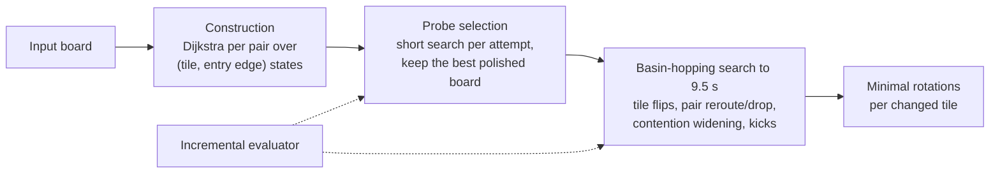

# HexTiles: a heuristic solver for TopCoder Marathon Match 166

My entry to TopCoder's [Marathon Match 166](https://www.topcoder.com/challenges/15f1c681-42b2-4f62-99c7-6f61fe5c57d9) (12–18 August 2026), a week-long optimization contest. A scrambled hexagonal board of up to 1,141 tiles must be rotated, tile by tile, so that each tile's three fixed chords chain into border-to-border paths connecting given pairs of exits. A case scores *(pairs connected) × (Σ path length × (bonus tiles crossed + 1) − moves × penalty)*, with 10 seconds per case, and the leaderboard rates each case against the best competitor on it.

**Read the full write-up: [report/writeup.md](report/writeup.md).** It covers the solver design, every shipped and rejected change with its measured effect, the evaluation methodology, a fresh 250-seed analysis of what the solutions look like, and an honest account of the gap to the top.


## Results in brief

- **Standing.** The provisional score rose from 35.6 (first version of this design) to a final **52.4**, with a best single reading of 55.0. Leaders scored 97–99.
- **Throughput and correctness beat cleverness.** The largest gain was a pure speed-up: an incremental evaluator that previews a move **11× faster** than a full re-score, worth **+20.3%** raw score. The second was fixing a silent routing bug and letting the search use its whole time budget (+7.5%).
- **Local measurement has blind spots.** Two configurations that won 250-seed local comparisons read lower on the grader, and a multiprocessing variant gained 12% locally on a grader that is effectively single-core. One unchanged build read 55.0 and later 49.7, so decisions were made on large local samples with a pre-committed ship rule.
- **The score has a shape.** Re-running the final build on 250 seeds shows **one serpentine path threading the bonus tiles carries 79% of the path score** (median). Search connects only 6 more pairs in every 100 than construction does, yet multiplies the score **×4.1**, mostly by growing that path. No component plans it; the tile-flip search discovers it.
- **The gap is architectural.** Per-pair routing optimizes the wrong unit for an objective dominated by one long path. Python throughput (about 80k evaluations per case) rules out the heavy annealing that can grow it further. The write-up quantifies the headroom in both factors.

## How the solver works



- **Routing with claim-and-lock.** Each exit pair is routed by Dijkstra's algorithm. An unclaimed tile offers four exits, each costing the rotations needed to realise it; a tile used by an earlier route is fixed wiring at zero cost. Several pair orders and bonus-tile plans give several candidate boards.
- **Every move is judged by the true objective.** The evaluator rests on a proven invariant: flipping tiles can only change paths that currently cross them. A preview retraces only those paths. Its correctness is checked against a frozen full evaluator after every commit in randomized tests.
- **Contention-aware rerouting.** Unconnected pairs turned out to be blocked by other pairs' tiles, not infeasible. On failure the reroute operator frees the tiles of a growing random set of other pairs and accepts the result only if the whole-board score improves. Its widening rounds stop at the deadline, which bounds tail latency.
- **Time as a managed resource.** An adaptive scheduler reserves 5.0–7.5 s for search, depending on board size. Short probes pick which construction to polish, because the immediate score picked wrong 7 times in 9.

## Quick start

```bash
cd tc_marathon_166
python -m venv .venv && source .venv/bin/activate
pip install -r requirements.txt          # the solver itself is standard library only

python -m pytest -q                      # 105 tests, about a minute
python src/main.py < report/data/board_seed199.in > moves.txt   # solve one case (9.5 s)

# With TopCoder's offline tester (Java 11+) placed at tools/tester.jar; see tools/README.md
scripts/run_seed.sh 199                  # one seed, with the visualizer
scripts/run_seeds.sh 1,20 4              # seeds 1-20 headless, 4 threads
python scripts/build.py                  # dist/HexTiles.py, the single-file submission
python report/make_figures.py            # regenerate the write-up's figures from report/data/
```

## Layout

| Path | Contents |
|---|---|
| `src/hextiles/solver.py` | Routing, construction attempts, probe selection, local search, contention widening, `solve()` |
| `src/hextiles/incremental.py` | The incremental evaluator |
| `src/hextiles/geometry.py`, `model.py`, `io_utils.py` | Hex geometry, input parsing, output |
| `src/main.py` | Entry point: one case on stdin, moves on stdout |
| `tests/` | Ground-truth random walks for the evaluator and the pair operators; probe-selection properties |
| `scripts/` | Tester drivers, configuration sweeps, mechanism benchmarks, the two oracle experiments, the run summarizer, the submission bundler |
| `baseline/HexTiles.java` | The day-one greedy baseline the Python solver grew out of |
| `report/` | The write-up, its figures, the data behind them, and `make_figures.py` |
| `tools/` | Where TopCoder's offline tester goes (not redistributed here) |

The source is the final submission. The only edits are three out-of-date comments in `solver.py` and the header of the Java baseline. The solver's syntax tree is identical to the submitted one, and its output on the case above is unchanged. Tested with Python 3.13 and OpenJDK 26.
