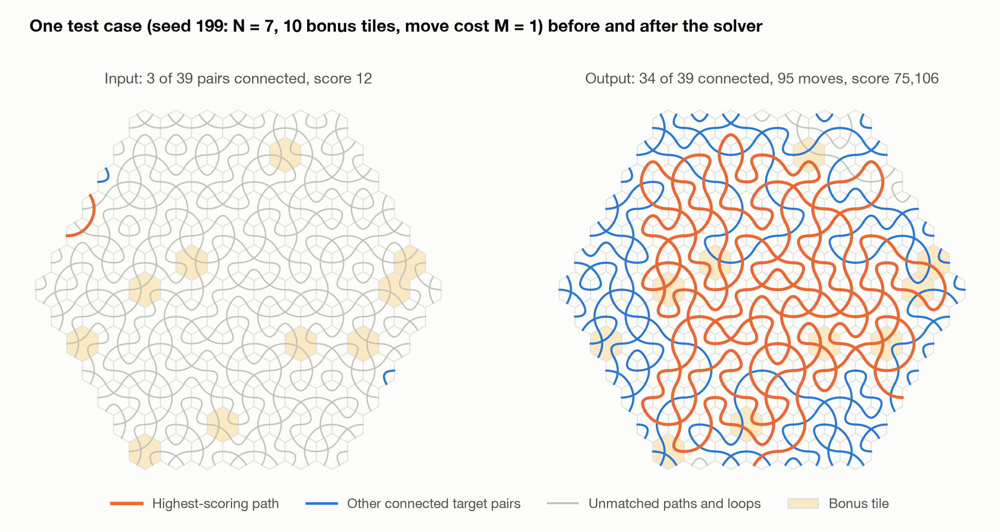
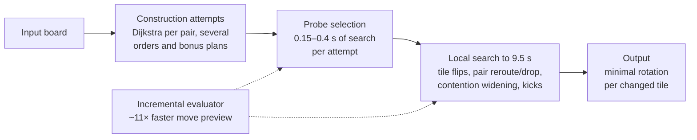
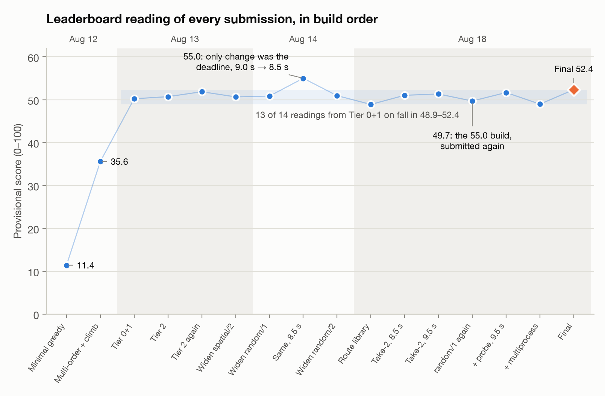
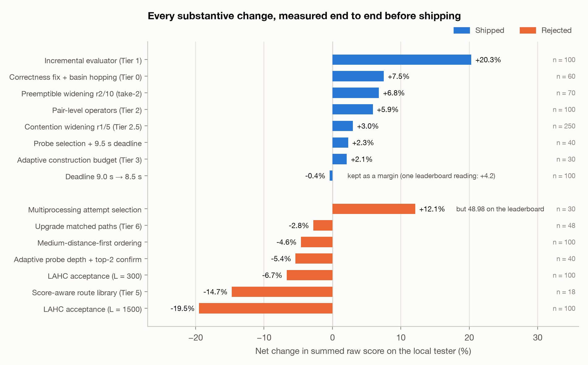
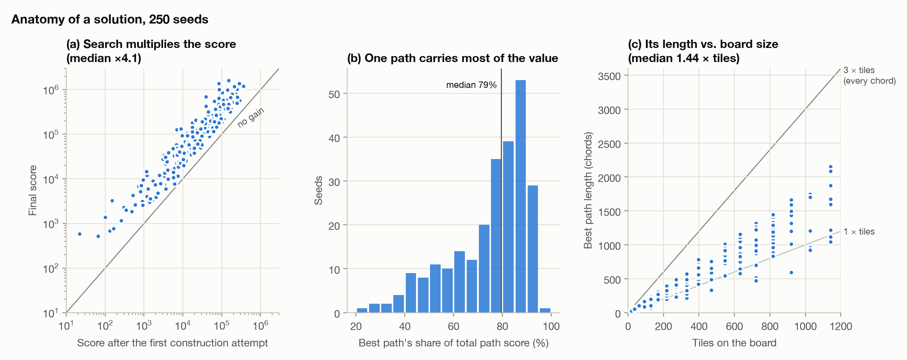
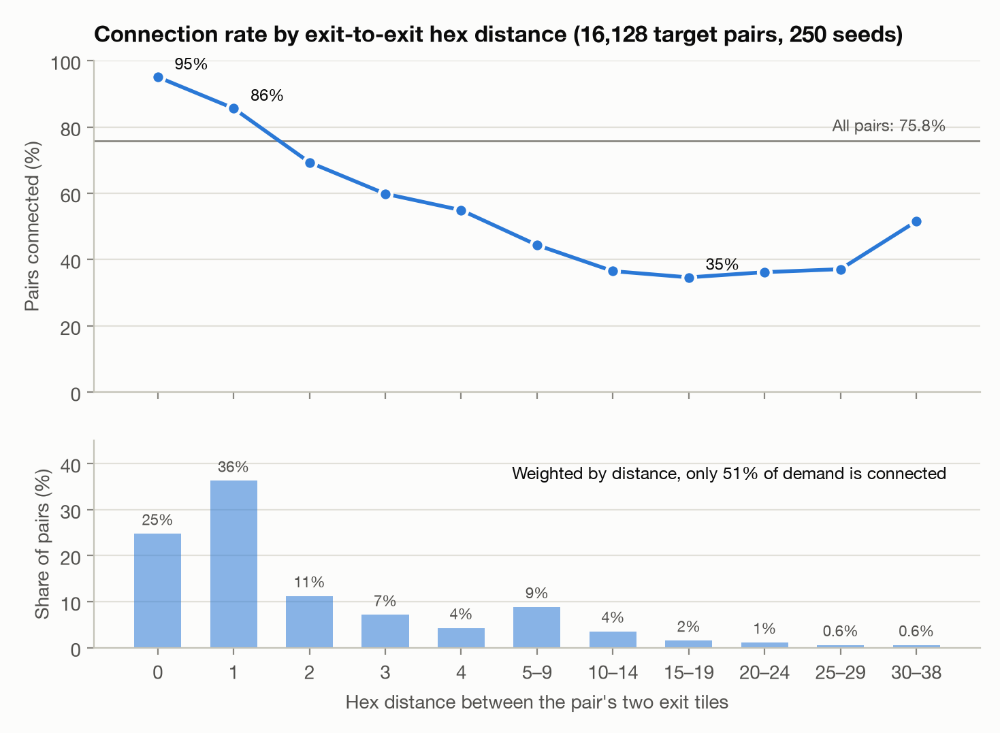

# One Path to Rule the Score: A Heuristic Solver for TopCoder Marathon Match 166 (HexTiles)

**Wangshu Pang** · October 2026

*A case study from one week of development on TopCoder Marathon Match 166, written in Python*

---

## Abstract

HexTiles is a combinatorial optimization puzzle. A hexagonal board of up to 1,141 tiles is given in a scrambled state. Each tile carries three fixed chords that pair up its six edges, and rotating a tile changes which edges are joined. The goal is to rotate tiles so that the chords chain into border-to-border paths connecting specified pairs of exits. The score is *(number of connected pairs) × (sum over connected paths of length × (bonus tiles crossed + 1) − moves × penalty)*. Each test case has a 10-second limit, and the leaderboard scores each case relative to the best competitor on it.

I built a three-stage Python solver. Construction routes each exit pair with Dijkstra's algorithm over a (tile, entry edge) state graph. Short "probe" searches then pick the most promising construction. Finally, basin-hopping local search combines single-tile moves, pair-level reroute and drop operators, and a contention-aware widening step. Every move is judged by the true objective, through an incremental evaluator that previews a move about 11× faster than a full re-score. Over the week the provisional score rose from 35.6 to a final 52.4 (best reading 55.0), against leaders at 97–99.

The work produced three groups of findings.

**(1) Throughput and correctness beat cleverness.** The largest single gain (+20.3% raw score) was the incremental evaluator, a pure performance change. The second largest (+7.5%) was fixing a silent routing bug and letting the search use its whole time budget. A one-line deadline change, 9.0 s → 8.5 s, cost 0.4% locally and produced the week's highest leaderboard reading.

**(2) Local measurement has blind spots, and some of them are expensive.** Two configurations that won clean 250-seed local comparisons read lower on the real grader. Both had a higher worst-case cost per call, which no local average can see. A multiprocessing variant gained 12% locally and lost on a grader that is effectively single-core. Single leaderboard readings also carry several points of noise: one unchanged build read 55.0 and later 49.7, so no single reading proves a cause. I describe the validation ladder and the pre-committed ship rule that came out of this.

**(3) The score has a shape, and the shape sets the ceiling.** For this write-up I re-ran the final build on 250 seeds and re-scored every output independently; all 250 agree with the official tester. In a typical solution, **one serpentine path threading the bonus tiles carries 79% of the total path score** (median). Construction connects 70% of pairs. Local search connects only 6 points more, yet multiplies the score by a median 4.1×, mostly by growing that one path. It reaches 1.44× the tile count, out of a 3× chord capacity. I also correct a diagnostic from the contest log: it claimed 21–31% of pairs were connected at large N, and that figure does not reproduce.

---

## 1. Introduction

TopCoder Marathon Matches are week-long optimization contests. Each problem has no known efficient exact solution. Submissions run on hidden test cases under a time limit, and each case is scored *relative to the best submission on that case*, so the leaderboard rewards whoever comes closest to the frontier on every instance. Match 166 ran 12–18 August 2026 as part of the Marathon Match Tournament, with 100 provisional test cases during the match and 5,000 in final testing.

This report is less a leaderboard story than a case study in three recurring engineering questions:

1. **How do you structure a time-bounded heuristic search** so that every component is correct, measurable, and spends the time budget where it pays?
2. **How do you decide whether a change helped** when the only local signal is a raw score on a different machine, and the official signal is relative, noisy, and costs a submission to read?
3. **When do you stop tuning** and recognise that the architecture, not the parameters, sets the ceiling?

I wrote the solver in Python for iteration speed. Section 9 returns to what that choice cost.

**Contributions.**

- A three-stage solver (§3) in which every move is judged by the true objective, through an incremental evaluator whose locality invariant is proven and diffed against an untouched ground-truth evaluator on every commit in randomized tests. The suite has 105 tests.
- A record of every substantive change and its measured effect (§5–6): eight shipped and eight rejected, each measured end to end. This includes the recurring failure pattern behind most rejections: greedy claiming exports cost onto other pairs.
- A measurement methodology (§7) for a setting where the local and official signals differ in hardware, aggregation and noise, together with the pitfalls it caught.
- A post-hoc analysis of what the final solutions look like (§8) and where the remaining gap lies (§9). It is based on a fresh 250-seed run and on the hidden boards recovered from the official test generator.

---

## 2. The problem

### 2.1 Rules

- **Board.** A regular hexagon with N tiles on each side (3 ≤ N ≤ 20), stored as a W×W array with W = 2N−1 and unused corners. It has 3N²−3N+1 tiles, from 19 to 1,141.
- **Tiles.** Each tile has six edges joined in pairs by three chords. At orientation 0 the chords join edges {0,5}, {1,3} and {2,4}; orientation r ∈ {0,…,5} adds r to every edge index (mod 6). One move rotates one tile by 60°, clockwise or anticlockwise.
- **Paths and exits.** Every border edge is an exit, giving 6(2N−1) exits. A path entering at an exit follows chords from tile to tile until it leaves at another exit. Chords that never reach the border form closed loops.
- **Target pairs.** The input lists P exit pairs. A path is *matched* if its two ends form a target pair.
- **Score.** A matched path scores its length (chords traversed) × (distinct bonus tiles it crosses + 1). With T the sum over matched paths, m the number of moves, and M ∈ {1,…,5} the move penalty, the raw score is

  ```
  raw = matched × (T − m × M), floored at 0
  ```

  There are B ∈ {1,…,10} bonus tiles and a hard cap of 24N² moves.
- **Leaderboard.** Each case scores raw / (best raw score among all competitors' latest submissions). The sum is rescaled to 0–100.
- **Limits.** 10 seconds of compute per case, one source file per submission.

Figure 1 shows a case before and after the final solver.



**Figure 1.** Seed 199 (N = 7, 39 target pairs, 10 bonus tiles, M = 1). In the scrambled input, 3 of 39 pairs happen to be connected. The output connects 34 with 95 rotations. The orange path is 202 chords long on a 127-tile board, crosses 9 of the 10 bonus tiles, and alone accounts for 88% of the total path score.

### 2.2 Facts that shaped the design

**Table 1.** Problem properties and their design consequences.

| Property | Consequence |
|---|---|
| Rotation preserves the chord gaps {1, 2, 2}, so opposite edges are never joined. An adjacent edge pair is realised by exactly one orientation, a gap-2 pair by two. | Routing state is (tile, entry edge) with four candidate exits. Each costs the minimum rotation (0–3 moves) needed to realise that chord. |
| The score multiplies the matched count by the net path score. | Each additional matched pair is worth about 1/matched of the whole score. Connecting an *expensive* pair can lower the score. The objective does not decompose by pair, so every candidate change is scored on the whole board. |
| A path scores length × (bonus tiles crossed + 1), and bonus tiles count per path. | One long path through all B bonus tiles is worth B+1 times its length. Local search discovers this structure (§8). |
| The output is a move list, but only the final orientation of each tile matters. | The solver searches over orientations and emits the minimal rotation per tile at the end, at most 3 moves per tile. That stays far below the 24N² cap: the highest observed use was 12.5% of it. |
| A tile has three chords, so up to three paths can cross it, and one path can revisit a tile through a different chord. | The router must handle revisits; the first version did not (§5.1). |
| The generator draws a hidden random board, defines the target pairs as the paths of that board, then scrambles every tile. | Every exit is paired, P = 3(2N−1) (15 to 117), and all pairs are connectable at once. I read the generator source only on the last day (§9). |

### 2.3 Evaluation setting

TopCoder provides an offline tester, a Java program, that generates the case for any seed, runs a solution over stdin and stdout, and reports the raw score. Local raw scores are reproducible. Leaderboard scores are not, for three reasons: each case is normalised by other competitors' best scores, which keep improving during the match; the grading hardware differs from mine; and the solver's search is bounded by wall-clock time.

---

## 3. Solver design

### 3.1 Overview



`solve()` builds the exit list by replicating the tester's border walk. It then constructs a series of candidate boards, probes each with a short search, keeps the best polished board, and searches from it until an internal deadline of 9.5 s. The remaining 0.5 s is margin under the hard 10 s limit (§5.5). Local search is guaranteed a size-scaled share of the budget, from 5.0 s at N = 3 to 7.5 s at N = 20, and construction may only use what is left.

### 3.2 Routing: Dijkstra over (tile, entry edge)

The router connects one exit pair on the current board (`try_connect` in `solver.py`).

- **Nodes.** One node per (tile, entry edge), plus one terminal node per exit.
- **Edges.** A tile already *claimed* by a previously routed pair is fixed: it offers one edge, at cost 0, following its current chord. An unclaimed tile offers the four non-opposite exit edges. Each costs the minimum number of rotations that makes the tile join entry to exit, which is 0 if the tile already does.
- **Bonus waypoints.** A pair can be assigned required bonus tiles. The state then carries a bitmask of required bonuses visited, and the goal requires all of them.
- **Commit.** The route is applied only if it fits the remaining move budget. Its tiles are rotated and marked claimed.

Claiming makes sequential routing tractable, because later pairs treat earlier routes as fixed wiring and may pass through them at no cost. It is also the source of the contention problem that dominates the rest of this report: early routes consume tiles that later pairs needed.

A subtle case: the state space lets a single route enter the same unclaimed tile twice through different edges. The two visits can demand incompatible orientations. When reconstruction detects this, the router excludes that tile and searches again, up to four times (§5.1).

### 3.3 Construction attempts

Pair order matters for a claim-and-lock router, so the solver tries several:

- nearest-first, farthest-first and bonus-first (by detour through the nearest bonus tile), plus three seeded shuffles;
- *bonus plans* that assign a bonus tile to 1, min(3, B) or B pairs. Pair–bonus candidates are ranked by `3 × direct distance − 2 × detour`, assigned greedily with each bonus used once, and the planned pairs are routed first.

An adaptive scheduler (`can_start_construction_attempt`) starts another attempt only if the expected duration, max(last, mean), plus 50 ms still fits before the local-search reserve begins. Small boards, where attempts are cheap, usually get all of them. On large boards, where a single attempt takes about 0.5 s, the solver keeps the time for search.

### 3.4 Probe-based selection

Choosing among attempts by their immediate score turned out to be wrong more often than right. In an oracle experiment on 9 real captured cases, each attempt was polished to completion. Picking by construction score chose the wrong attempt in 7 of the 9 cases and left 6.55% of the final score unrealised. A board's immediate score says little about the basin it leads into.

The solver therefore gives each attempt a short local search, from 0.15 s at N = 3 to 0.4 s at N = 20, keeps the best *polished* board, and resumes searching from it. Probing only runs when there are at least three attempts. It was net-negative on its own, because probe time comes out of the winner's search time. It became positive only together with the deadline moving from 8.5 s to 9.5 s (§5.6).

### 3.5 Local search: basin hopping

`improve_grid` loops until the deadline:

1. **Tile pass.** Visit every tile in random order, preview all five alternative orientations, and commit the best one if it improves the objective. The objective is compared as the tuple (score, matched, path score, −moves), so ties are broken toward more matches and more path length. That keeps progress possible while the floored score is still 0.
2. **Pair pass.** Visit every target pair in random order. If the pair is matched, `drop_pair` tests reverting its tiles to their input orientations; this catches pairs whose move cost exceeds their value (§2.2). If it is unmatched, `reroute_pair` tries to route it against the rest of the board (§3.6).
3. **Kick.** If a full pass finds no improvement, apply a random perturbation unconditionally. With equal probability, either 1–6 random tiles or every tile on 2–5 random pairs' paths gets a random orientation. If more than six consecutive stalled passes go by without a new best board, the search returns to the best board seen.

The best board is tracked separately from the current one, so the output can never be worse than the input to the search. This is basin hopping [3], or iterated local search [4]: hill-climb, perturb, hill-climb again. Section 6 explains why an acceptance rule that tolerates downhill moves did not help here.

### 3.6 Contention-aware rerouting ("widening")

An unmatched pair's two exits each trace a dead-end path that ends at the wrong exit. `reroute_pair` frees the tiles of those two traces, keeps everything else fixed, and asks the router for a connection. Previewed through the evaluator, the result is accepted only if the *whole-board* objective improves. This allows breaking another pair, but only when the trade pays.

Two facts shaped this operator:

- **Rerouting a matched pair is provably a no-op.** Every unclaimed tile has exactly one zero-cost exit for a given entry edge, its current chord. A route through the pair's own freed tiles at total cost 0 must therefore follow the existing path, and any other route costs more. Hence the pair pass routes only unmatched pairs and only tests dropping matched ones. A regression test locks this in.
- **Unmatched pairs are blocked by contention, not infeasibility.** Freed only their own traces, stuck pairs were rerouted 7–13% of the time. On an otherwise free board, 95–100% of the same pairs were connectable. Freeing 5 random *other* pairs' tiles unblocked 33–78% of them.

So on failure, `reroute_pair` *widens*. Each round adds the tiles of k more pairs to the freed set and tries again, cumulatively, stopping at the first success. Three ways of choosing those pairs were built and benchmarked: random; *spatial* (pairs with exits near the stuck pair's corridor); and *frontier* (pairs owning the tiles the failed search reached). Random won. Frontier had the best hit rate, but its extra scan cost crowded out the tile pass (−2% to −16%). The shipped configuration is random, 2 rounds, 10 pairs per round. Widening rounds are skipped once the deadline has passed, which bounds a late call's overrun to about one Dijkstra (§5.4).

### 3.7 The incremental evaluator

Re-scoring a board means tracing every exit, which takes about 1.08 ms at N = 20. The tile pass previews five orientations per tile, so a single pass over an N = 20 board took 7–9 s. That is the entire budget for one sweep.

`IncrementalEvaluator` rests on one invariant:

> Flipping a set of tiles can change the trace of an exit only if its *current* trace passes through one of those tiles. Any trace whose prefix avoids every flipped tile is unchanged.

The evaluator keeps a map from each tile to the exits whose current trace touches it, storing *both* endpoints of every path. A preview takes the union of owners over the flipped tiles, subtracts their contributions, retraces only those exits on the temporarily flipped board, restores the board, and returns the new objective. A commit applies a preview without recomputing it.

- **Speed.** 96.5 µs per preview versus 1,081 µs for a full evaluation at N = 20 (11.2×), and 4.1× at N = 5. In a 3 s budget at N = 20, the search went from zero completed tile passes to three.
- **A flawed first design, caught before it shipped.** A prototype that stored ownership under one endpoint per path silently double-counted whenever a flip re-partitioned a tile owned by several paths. At N = 20, 65–80% of tiles have two or three owners. The prototype diverged from ground truth in 7 of 9 randomized 150-commit test chains, sometimes healing back by coincidence, which is why the tests check every commit rather than only the final state.

### 3.8 Engineering practices

- **Ground truth stays frozen.** `evaluate_grid`, the full re-score, was never modified. Every incremental operator is tested by randomized walks that compare against it after *every* commit (41 evaluator tests and 62 pair-operator tests).
- **Proven properties become tests.** These include the matched-pair no-op, "round 0 of a widened reroute is identical to the narrow reroute", and "probe selection never returns a worse board than the old rule given the same work".
- **Experiments are switches, defaults are the shipped build.** Experimental options are environment variables (`HEXTILES_WIDEN_*`, `HEXTILES_PROBE_SELECTION`, `HEXTILES_SOLVE_DEADLINE`). Unset, as on the grader, they fall back to the submitted configuration, so sweeps never needed code edits.
- **One-file submission.** TopCoder accepts a single source file. `scripts/build.py` concatenates the package into `dist/HexTiles.py`, and each bundle was spot-checked against the tester before submission.
- **Reproducibility.** Random sources are seeded from the board. A/B runs fix `PYTHONHASHSEED=0`, because set iteration order otherwise perturbed the bonus planner and produced cross-run noise of a few percent.

---

## 4. Development timeline

**Table 2.** Development phases and leaderboard readings (provisional, 0–100).

| Date | Phase | Readings |
|---|---|---|
| 12 Aug | A first minimal submission. Then the design described here: Dijkstra construction over several orders, plus hill climbing. | 11.4, 35.6 |
| 13 Aug | Tier 0: routing bug fix, basin hopping. Tier 1: incremental evaluator. Tier 2: pair-level operators. | 50.2, 50.7, 51.9 |
| 13–14 Aug | Tier 2.5: contention widening. Configuration reversals. Deadline 9.0 → 8.5 s. | 50.7, 50.9, **55.0**, 51.0 |
| 15–17 Aug | Diagnostics on the plateau; score-aware route library and path-upgrade operators (both rejected). | — |
| 18 Aug | Tier 3: adaptive budget. Take-2: preemptible widening. Probe selection. Multiprocessing (rejected). Final submission. | 48.9–52.4 (7 recorded readings), final **52.4** |



**Figure 2.** Every leaderboard reading recorded in the development log, in build order; the order within 18 August is approximate. After Tier 0+1, 13 of 14 readings fall within a 3.5-point band. The exception is 55.0, and the same build read 49.7 when submitted again on 18 August. Readings are relative to the field's best per case, so they also drift as other competitors improve.

The first day's work produced the architecture. The second produced most of the measurable gain. After that, readings plateaued in a band too narrow for single readings to rank builds against each other. Section 7 describes how decisions were made from that point on.

---

## 5. What shipped, and why it worked

Figure 3 summarises every substantive change, shipped and rejected, by its end-to-end effect on summed raw score over tester seeds.



**Figure 3.** Net change in summed raw score on the local tester for each change, against the build it was meant to replace; n is the number of seeds, or seed × N comparisons, in the deciding comparison. Two results run against the grain. The deadline trim lost locally and was kept as a safety margin after a higher leaderboard reading. Multiprocessing won locally and was dropped after a lower one.

### 5.1 Correctness and budget use (Tier 0, +7.5%)

Two defects, both silent:

- **Revisit bug.** About 3–5% of routes visited one tile twice with incompatible orientation requirements. The second visit silently inherited the first visit's orientation, so the route spent moves and claimed tiles but scored nothing. The first fix, abandoning the pair, made results *worse* on about 40% of seeds because it discarded pairs that had a valid detour. The shipped fix retries with the conflicting tile excluded.
- **Unused budget.** Hill climbing returned at its first local optimum, using 0.1–2.5% of the available time on small and medium boards. Converting it to basin hopping used the full budget.

Validated on 60 seeds: 24 used during development and 36 held out. The held-out seeds alone improved by 10.4%.

### 5.2 Throughput (Tier 1, +20.3%)

The incremental evaluator (§3.7) changes *how fast* the search runs, not *what* it does. A regression test confirmed that, given the same number of passes, the old and new search produce bit-identical boards. More of the same beneficial search can only help, so the 100-seed result was monotone: every seed equal or better. The largest gains came on the most time-starved large boards (+108% and +125% on two N = 20 seeds).

### 5.3 Pair-level operators (Tier 2, +5.9%)

Single-tile flips cannot connect a pair that needs a coordinated change along a whole route, and cannot ask whether a pair is worth its moves. The reroute and drop operators (§3.5–3.6) and pair-level kicks were added. The result was +5.9% over 100 seeds, with 65 seeds improved, 31 worse and 4 equal; the regressions are expected, since a new move type changes the search trajectory. On the leaderboard it registered as +0.5, from 50.2 to 50.7, an early warning that the leaderboard would not resolve effects of this size.

### 5.4 Contention widening, two attempts (Tier 2.5, +3.0%; take-2, +6.8%)

Widening (§3.6) was built only after the diagnosis above, that pairs are blocked by contention rather than infeasibility. Choosing its configuration produced the most instructive sequence of the week:

1. A one-seed-per-size synthetic sweep favoured spatial selection with 2 rounds. A 100-seed comparison agreed, but only by +0.57% head to head, with a 48/48/4 win/loss/tie split.
2. That build read **below** the previous Tier 2 build on the leaderboard. Rather than blame noise, I re-ran at 250 seeds. Seeds 101–250 favoured *random* selection decisively, and over all 250 seeds random/1 round beat spatial/2 rounds by 0.98%. The earlier lead had been sampling noise.
3. Random/1 read 50.85 on the leaderboard, still unexpectedly low. Widening calls could not be interrupted, so one slow call on slower hardware could push the solver past its deadline. Trimming the internal deadline from 9.0 s to 8.5 s cost 0.4% locally and read **55.0**.
4. Random/2 rounds then won locally by +1.02% over 250 seeds and read **51.0**. It was the second time a configuration with a higher *worst-case per-call cost* had won locally and read lower on the grader.

The second attempt ("take-2") addressed the mechanism rather than the symptom. Widening rounds now check the deadline before starting, so a late call can overrun by at most one Dijkstra. The `pairs_per_round` dimension, never swept the first time, was swept as well. Random, 2 rounds, 10 pairs gave +6.8% over 70 seeds against the adaptive-budget base. Its +2.3% margin over the next-best configuration was stable across three disjoint seed segments (+2.2%, +2.8%, +2.0%). It shipped in the final build.

### 5.5 The deadline as a first-class parameter

At the time, the jump from 50.85 to 55.0 was read as proof that grader tail latency was the binding constraint. Four days later the same build, submitted unchanged, read 49.7, so a single reading cannot carry that conclusion. Two weaker statements survive. No configuration with a higher worst-case per-call cost ever read higher on the leaderboard than its cheaper alternative. And a local run cannot observe the risk at all: on my machine the search finishes within 30 ms of whatever deadline it is given. Margin under the hard limit and preemption points in heavy operators are cheap insurance against a failure that local testing cannot see, so the solver kept both. Making widening preemptible (§5.4) is what later allowed part of the margin to be spent again (§5.6).

### 5.6 Adaptive construction budget (Tier 3, +2.1%) and probe selection (+2.3%)

The original solver used a fixed rule: many construction attempts if N ≤ 12, otherwise one. The adaptive scheduler (§3.3) replaced it, for +2.1% over 30 seeds with unchanged runtime.

Probe selection (§3.4) was tested as a 2×2 against the 8.5 s build on 40 seeds. Probes alone scored −0.6%, because probe time comes out of the winner's search time. The 9.5 s deadline alone scored −4.6%. Both together scored **+2.3%** (22 wins, 16 losses, 2 ties). The extra second pays for the probes. This combination is the final configuration. It read 51.7 when first submitted and 52.4 as the final submission.

---

## 6. Negative results

**Table 3.** Rejected changes, each measured end to end.

| Change | Idea | Result | Why it failed |
|---|---|---|---|
| Score-aware route library (Tier 5) | Offer each pair several route styles (cheapest, bonus-seeking, low-contention) and pick by marginal score | −14.7% end to end (0 W / 8 L / 10 T) | Longer routes claim more tiles and squeeze every pair routed after them |
| Route library, two styles, bounded-hop DP | "Longest route within slack" via a layered DP; acyclic by construction, so no negative-cycle risk | +1.7% matched, −0.3% score; read 48.9 on the leaderboard | Pairs that would match anyway lost path length; construction time came out of search |
| Upgrade matched paths (Tier 6) | Reroute a matched pair's corridor to lengthen it or pick up a bonus | −2.8% (−7.6% combined with the route library) | The same externality inside the search loop |
| Medium-distance-first ordering | Route pairs from the low-match distance band first | −4.6% (20 W / 55 L) on fresh seeds 401–500 | Same externality, a third time; the probe was also fooled by basins that look good early |
| Multiprocessing attempt selection | Polish several attempts in parallel processes | **+12.1%** locally (30 seeds); read 48.98 | The grader is effectively single-core; process overhead without parallelism |
| Adaptive probe depth + top-2 confirmation | Probe close contests deeper; re-check the top two | −5.4% (40 seeds), worst seed −94% | Probe time is taken from the eventual winner's search |
| Late-acceptance hill climbing [5] | Accept moves no worse than the score L steps ago | −6.7% (L = 300), −19.5% (L = 1500) | About 80k evaluations per case is too short an anneal; tolerated downhill steps displace improving ones |
| Pair-loop multiplier | Run the pair pass several times per tile pass, since the tile pass used 91–95% of search time at large N | +2.2% in a simplified harness; −1.7%, −3.5%, +1.0% (×3, ×5, ×8) through the real pipeline | The harness re-implemented part of the pipeline; the effect did not survive the real one |

Three patterns account for most of these:

1. **The contention externality** (route library, path upgrades, medium-first ordering). Any change that makes one path longer or better is paid for by the shared tile pool, and a pair-at-a-time framework cannot price that cost.
2. **Myopic proxies.** Construction score picked the wrong attempt 7 times in 9, and a 0.4 s probe was fooled by basins that look good early. A proxy one step removed from the real objective can rank candidates in the wrong *order*, not just with more noise.
3. **Scarce throughput.** At roughly 10,000 previews per second, the search cannot afford acceptance rules that spend evaluations going downhill, or probes that take time from the winner.

A related diagnostic closed a line of work before it was built. From the final board of each of 9 real cases, an offline oracle searched for path upgrades with generous slack and a 3-second-per-pair budget. It found +0.34% in total. The same wall-clock time handed back to plain local search found +4.14%. The premise that construction bakes in short paths which search cannot recover had almost no headroom.

---

## 7. Evaluation methodology

### 7.1 What the local signal is, and is not

The local tester gives exact raw scores for any seed. Two properties matter when reading them:

- **Near-deterministic under identical conditions, not across machines.** For this write-up, seeds 1–40 were run twice under identical settings (4 threads, fixed hash seed). 36 of 40 scores matched exactly, the largest deviation was 9.9%, and the totals differed by 0.5%. When the machine load changes, the trajectory changes. Seed 3 scored 349,743 in a 4-thread batch and 284,071 run alone, because deadline-bounded probes pick differently at different speeds. A grader result for a single case is one draw from a distribution.
- **Blind to grader tails.** No local sample size reveals the worst-case duration of an uninterruptible operator on slower hardware (§5.5).

### 7.2 Validation ladder

Each change climbed the same ladder, and most were stopped on a lower rung:

1. **Ground-truth tests.** Randomized walks diffed against the frozen evaluator after every commit.
2. **Mechanism benchmarks.** Per-call cost, including worst-case calls, and passes completed within a real wall-clock budget (`scripts/benchmark_*.py`).
3. **Screen.** About 20 seeds on the real tester, with a fixed hash seed.
4. **Comparison.** 70–250 seeds, with wins, losses and ties and per-segment consistency, not only the total.
5. **Out-of-sample confirmation.** Fresh seed blocks (301–400, 401–500) never used in tuning.
6. **One submission**, read as a single noisy sample.

### 7.3 Pitfalls the ladder caught

**Table 4.** Measurement pitfalls encountered, each with its evidence.

| Pitfall | Evidence | Rule adopted |
|---|---|---|
| Thin margins reverse at larger samples | Spatial vs random widening: +0.57% at 100 seeds became −0.98% at 250 | Margins under 1% are not decisions; re-run at a larger scale |
| Simplified harnesses lie | Pair-loop multiplier: +2.2% in a stand-alone harness, negative through the real pipeline | Benchmark through the real `solve()`, never a re-implementation |
| Compressed budgets lie | Route library: −15.7% at a 1.5 s budget, −0.3% at 6 s; the per-call cost ate the compressed window | Test at the production budget |
| Local averages hide grader tails | Two configurations with a higher worst-case call cost won locally and read lower on the grader | Give heavy operators preemption points; keep margin under the hard limit |
| Local parallelism is not grader parallelism | Multiprocessing: +12.1% locally, 48.98 on the grader | Do not assume more than one core |
| Single leaderboard readings are noisy | Same build: 55.0 then 49.7; another build 50.7 then 51.9 | Tune on large local samples only; treat each reading as one sample |
| Hash-order noise | Set iteration order shifted bonus plans between processes | `PYTHONHASHSEED=0` for every A/B run |

### 7.4 Decision rule for the final day

With the leaderboard unable to separate builds, the last day ran on a rule fixed in advance. A challenger ships only if it gains at least 2% on 100 fresh seeds with zero failed cases and no runtime regression. Ten challenger configurations were measured that evening, including late-acceptance search and medium-distance-first ordering. None met the bar, so the validated build stayed.

---

## 8. Results

### 8.1 Leaderboard

| | Provisional score |
|---|---|
| First design (12 Aug) | 35.6 |
| Best single reading (14 Aug) | 55.0 |
| Final submission (18 Aug) | 52.4 |
| Leaders at the end | 97–99 |

### 8.2 Reproduction of the final build

For this report the final build was run on seeds 1–250 against the official tester (4 threads, `PYTHONHASHSEED=0`): 0 failed cases, mean runtime 9.52 s, maximum 9.54 s. Every output was replayed and re-scored by an independent script (`scripts/summarize_run.py`), which agrees with the tester on all 250 seeds. The same script rebuilds each seed's first construction attempt, to separate what construction achieves from what search adds.

**Table 5.** The final build on seeds 1–250, by board size.

| N | Seeds | Pairs per case | Connected after construction | Connected at the end | Final ÷ construction score (median) | Best path's share of path score (median) | Move penalty ÷ path score | Median score |
|---|---|---|---|---|---|---|---|---|
| 3–6 | 57 | 24 | 68.9% | 79.8% | ×4.1 | 75% | 19.1% | 7,665 |
| 7–10 | 60 | 49 | 71.0% | 75.3% | ×4.0 | 77% | 13.0% | 58,035 |
| 11–14 | 56 | 73 | 69.4% | 75.0% | ×4.3 | 84% | 8.7% | 245,551 |
| 15–17 | 47 | 94 | 69.3% | 75.7% | ×4.1 | 83% | 9.7% | 447,849 |
| 18–20 | 30 | 112 | 69.6% | 75.5% | ×3.4 | 81% | 8.6% | 660,667 |
| **All** | **250** | **65** | **69.7%** | **75.8%** | **×4.1** | **79%** | **9.8%** | |

### 8.3 Anatomy of a solution



**Figure 4.** (a) Final score against the score of the first construction attempt, one point per seed: search multiplies the score by a median 4.1×. (b) The best single path's share of total path score: median 79%. (c) The best path's length against the number of tiles: median 1.44× the tile count. A path could at most use every chord, 3× the tile count, and other paths need some of them.

Table 5 and Figure 4 describe the solutions more precisely than anything I measured during the match:

- **Construction already connects most pairs** (69.7%). Search raises that by about 6 points, an average of 3.9 pairs per case, yet multiplies the score by 4.1×.
- **The multiplier comes from path value, not match count.** The best path carries 79% of the total path score in the median case. It crosses every bonus tile in 156 of 250 seeds, and it winds through the board for 1.44× as many chords as there are tiles. Because a path's score is its length × (bonus tiles + 1), lengthening a path that already crosses all B bonus tiles earns B+1 points per chord.
- **Nobody designed this path.** No component of the solver plans a board-spanning route. The tile pass, accepting any flip that raises the true objective, grows it one splice at a time: rotating one tile can join two path segments into one longer path.
- **Moves are cheap.** The move penalty is 9.8% of the path score overall and 8.6% on the largest boards.

### 8.4 Where pairs are lost



**Figure 5.** Connection rate by the hex distance between a pair's two exit tiles (top) and the distribution of pairs (bottom), over the 16,128 target pairs in seeds 1–250.

Most target pairs are short, because random paths mostly leave the board near where they entered: 61% join exits on the same or adjacent tiles. Those pairs are connected 86–95% of the time. The rate falls to 35–37% for pairs 10–29 tiles apart. Weighted by distance, which tracks the length a pair's path must have, only **51%** of the demand is connected.

### 8.5 A correction to the contest-time diagnosis

During the match the development log recorded match rates of 21–31% on large boards, "not improving over 8 s of search". That figure motivated the pair-level work in Tiers 2 and 2.5. It does not reproduce. The final build's first construction attempt connects 69.6% of pairs on boards with N = 18–20, and 75.5% after search. Even the day-one greedy baseline in `baseline/` connects 76 of 117 pairs (65%) on seed 2. The tiers it motivated still stand, because each was validated by end-to-end score rather than by that number. Their explanation changes: an additional connected pair is valuable because it raises the *multiplier* on a path score dominated by one long path, not because most pairs were unconnected.

---

## 9. The gap to the top

**The hidden board is a proof of feasibility, not a good answer.** Re-running the tester with `-showOriginal` recovers the board each case was generated from, where every pair is connected. Rotating every tile back to it is a valid solution, and it never beats the final build (0 of 250 seeds). It scores 0 on 89 seeds, because rotating every scrambled tile back (3.4× as many moves as the solver uses, in the median case) costs more than the random paths are worth. Its median score is 0.17× the solver's. The prize is not connecting all pairs as the generator happened to, but connecting them *while* building long, bonus-threaded paths with few moves.

**Remaining headroom, factor by factor.** A provisional score of 52 means the solver's raw score is about half the best competitor's on a typical case, so the leaders score roughly 1.9× more. The score is a product, and both factors have room:

- *Match count.* 24% of pairs remain unconnected. Connecting all of them is worth up to ×1.32 on the multiplier, plus whatever path value those pairs carry.
- *Path value.* The best path uses 1.44 chords per tile out of 3. The full 3× is not reachable, since other paths need chords, but raising it to 2 chords per tile would be worth about ×1.4 on the term that carries 79% of the path score.

Either factor could account for most of the gap, and the leaders probably gained on both. This analysis is inferred from the score's structure, not from their code.

**Why this architecture plateaued.**

1. **It optimizes the wrong unit.** Construction minimizes the rotation cost of each pair in turn. The objective rewards one board-spanning, bonus-threaded path multiplied by the number of connections. Search found that structure one tile at a time, but construction never aims at it, and every claim-and-lock decision constrains it.
2. **Throughput.** At about 100 µs per preview, Python affords roughly 80,000 evaluations per case. A compiled implementation of the same incremental idea could plausibly run 100–1,000× more. That buys proper annealing over orientations [6], in which contention between pairs can resolve gradually instead of through explicit widening.
3. **I read the generator late.** The tester source states outright that every exit is paired and that all pairs are jointly feasible. On day one, that would have pointed at match count and path structure as the whole game, and at a different design.

**What I would do differently.** Read the generator and the scoring code first, then derive what an ideal solution looks like before choosing an algorithm; here that means "one long path through every bonus tile, multiplied by the number of connections". Choose a compiled language whenever a problem rewards search volume. Spend the first half of the week on architecture-level experiments and the second half on tuning. In this match about 90% of the effort went into a design whose ceiling was in the mid-50s, tuned close to its measured optimum.

---

## 10. Lessons

1. **Make it correct, then make it fast, then make it clever.** The two largest gains were a bug fix with full budget use, and a pure speed-up.
2. **Prove the invariant, then test every commit against frozen ground truth.** That caught a double-counting evaluator before it ever shipped.
3. **Diagnose before building.** Widening was built after measuring that stuck pairs were blocked, not infeasible, and the direction was right first time.
4. **Treat time as a resource with a tail.** Keep margin under a hard limit, and give every heavy operator a preemption point.
5. **Know what each signal can see.** Local averages miss grader tails, single leaderboard readings are noisy, and harness results do not transfer to the real pipeline.
6. **Write down negative results as carefully as positive ones.** This report was possible because every attempt was logged with its data. Re-measuring for the write-up still overturned one logged diagnostic.
7. **Understand the objective's shape before choosing an architecture.**

---

## 11. Threats to validity

- **Hardware.** All local measurements come from one development machine, and the grader's hardware and load are unknown.
- **Historical numbers.** Effect sizes in §5–6 come from the development log. They were measured against the build current at the time, on the seeds stated, and were not re-run for this report. Only §8–9 come from the fresh 250-seed run.
- **Seed overlap.** Seeds 1–250 include seeds used during development (mostly 1–100). That is acceptable for describing the final build, not for claiming generalisation; the out-of-sample blocks in §7.2 served that purpose.
- **Provisional scores.** They cover 100 cases, are relative to a moving field, and are noisy. Final standings come from 5,000 different cases.
- **Inferences about the leaders** are drawn from the score's structure, not from their code.

---

## 12. Conclusion

I built a correct, measurable and well-instrumented Python heuristic for a combinatorial puzzle, and improved it from 35.6 to a final 52.4 through correctness fixes, a proven incremental evaluator, contention-aware search operators and a deliberately managed time budget. The engineering held up: zero failed cases, a frozen ground truth, and every change measured end to end. The ceiling came from the architecture, which optimized per-pair routing cost while the objective rewarded one long, bonus-threaded path multiplied by the number of connections. The most transferable lessons are about method: derive what a good solution looks like before designing the search, give every expensive operation a bounded tail, and know exactly what each measurement can and cannot see.

---

## Acknowledgements and tooling

Development used an AI coding assistant (Claude) for implementation, benchmarking scripts, analysis and review. Design decisions, experiment selection and submission decisions were my own. The offline tester, the problem statement and the test-case generator are TopCoder's.

## References

1. TopCoder. *Marathon Match 166: HexTiles*, August 2026. https://www.topcoder.com/challenges/15f1c681-42b2-4f62-99c7-6f61fe5c57d9
2. Dijkstra, E. W. (1959). A note on two problems in connexion with graphs. *Numerische Mathematik*, 1, 269–271.
3. Wales, D. J., & Doye, J. P. K. (1997). Global optimization by basin-hopping and the lowest energy structures of Lennard-Jones clusters containing up to 110 atoms. *Journal of Physical Chemistry A*, 101(28), 5111–5116.
4. Lourenço, H. R., Martin, O. C., & Stützle, T. (2003). Iterated local search. In F. Glover & G. Kochenberger (Eds.), *Handbook of Metaheuristics* (pp. 320–353). Springer.
5. Burke, E. K., & Bykov, Y. (2017). The late acceptance hill-climbing heuristic. *European Journal of Operational Research*, 258(1), 70–78.
6. Kirkpatrick, S., Gelatt, C. D., & Vecchi, M. P. (1983). Optimization by simulated annealing. *Science*, 220(4598), 671–680.
7. Shaw, P. (1998). Using constraint programming and local search methods to solve vehicle routing problems. In *Principles and Practice of Constraint Programming (CP-98)*, LNCS 1520, 417–431.
8. Dean, J., & Barroso, L. A. (2013). The tail at scale. *Communications of the ACM*, 56(2), 74–80.

---

## Appendix A. Repository map

Paths are relative to the `tc_marathon_166/` directory of this repository.

| Path | Contents |
|---|---|
| `src/main.py` | Entry point: read a case from stdin, solve, write moves to stdout |
| `src/hextiles/geometry.py` | Directions, chord table, rotation helpers |
| `src/hextiles/model.py`, `io_utils.py` | Input parsing and output formatting |
| `src/hextiles/incremental.py` | `IncrementalEvaluator` (§3.7) |
| `src/hextiles/solver.py` | Routing (§3.2), construction (§3.3), probe selection (§3.4), local search (§3.5), widening (§3.6), `solve()` |
| `tests/` | Ground-truth random walks for the evaluator and pair operators; probe-selection properties |
| `scripts/run_seed.sh`, `run_seeds.sh`, `find_java.sh` | Run the official tester on one seed (with the visualiser) or a seed range |
| `scripts/sweep_widen.sh` | Configuration sweeps through the `HEXTILES_WIDEN_*` switches |
| `scripts/benchmark_*.py` | Mechanism benchmarks: per-call cost, passes per budget, operator hit rates |
| `scripts/investigate_*.py` | The attempt-selection and path-upgrade oracles (§3.4, §6) |
| `scripts/summarize_run.py`, `read_only.py` | Re-score a tester run and produce the CSVs behind §8–9 |
| `scripts/build.py` | Bundle the package into the single-file submission `dist/HexTiles.py` |
| `baseline/HexTiles.java` | The day-one greedy baseline: per-pair Dijkstra in nearest-first order, no search |
| `report/` | This report, its figures, the data behind them, and `make_figures.py` |

The source is the final submission. The only edits are three comments in `solver.py` and the header of `baseline/HexTiles.java`, which were out of date. The solver's syntax tree is unchanged.

## Appendix B. Reproducing the results

```bash
cd tc_marathon_166
pip install -r requirements.txt
# Download the offline tester from the match page and place it at tools/tester.jar (see tools/README.md).

# Final build on seeds 1-250, saving every input and output (~10 minutes on 4 threads)
mkdir -p runs/final runs/hidden
PYTHONHASHSEED=0 java -jar tools/tester.jar -exec "python3 src/main.py" -seed 1,250 \
    -threads 4 -novis -printRuntime -saveSolInput runs/final -saveSolOutput runs/final \
    > runs/final/scores.txt

# The hidden boards, for §9
java -jar tools/tester.jar -exec "python3 scripts/read_only.py" -seed 1,250 -threads 8 \
    -novis -showOriginal -saveSolInput runs/hidden

python3 scripts/summarize_run.py runs/final report/data runs/hidden   # writes seeds.csv, match_by_distance.csv
python3 report/make_figures.py                                       # writes report/figures/*.png
```

`report/data/` holds every number plotted:

- `seeds.csv`: one row per seed of the 250-seed run, including construction-only and hidden-board scores;
- `match_by_distance.csv`: target pairs and connected pairs by exit-to-exit distance;
- `submissions.csv`: every leaderboard reading recorded in the development log;
- `changes.csv`: the measured effect of every substantive change (§5–6);
- `board_seed199.in`, `.out`: the case drawn in Figure 1 and the solver's answer.

Scores from a fresh run will differ slightly from the CSVs, because the search is bounded by wall-clock time (§7.1).

## Appendix C. Glossary

| Term | Meaning |
|---|---|
| Chord | One of a tile's three segments joining two of its edges; path length counts chords |
| Exit | A border edge; target pairs are pairs of exits |
| Matched / connected | A path whose two ends form a target pair |
| Claimed tile | A tile fixed by an earlier route during construction |
| Construction attempt | One full pass of routing all pairs in a given order, optionally with a bonus plan |
| Probe | A short local search used to rank construction attempts |
| Widening | Freeing more pairs' tiles when rerouting a stuck pair (§3.6) |
| Kick | A random perturbation applied when local search stalls |
| Raw / provisional score | The per-case score from the formula / the 0–100 leaderboard score relative to the field |
